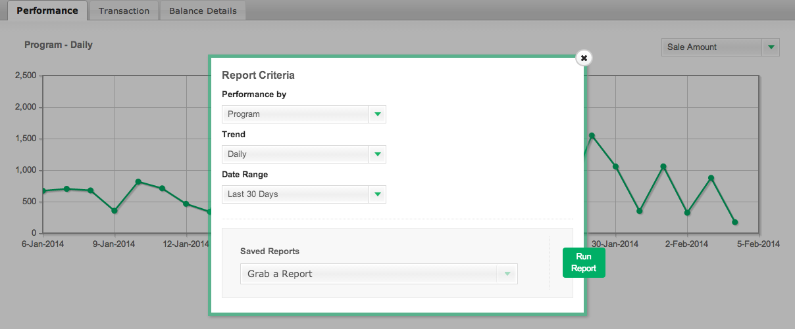

# 导入 [!DNL CJ Affiliate] 数据

导入 [!DNL CJ Affiliate (Commission Junction)] 数据到 [!DNL Adobe Commerce Intelligence]，只需执行以下步骤，然后将生成的文件附加到 [支持服务单](https://experienceleague.adobe.com/docs/commerce-knowledge-base/kb/troubleshooting/miscellaneous/mbi-service-policies.html). Adobe将设置您帐户的数据表，并允许您继续独立上传数据。

## 导出 [!DNL CJ Affiliate] 数据

1. 在您的 [!DNL CJ Affiliate] 帐户，转到 `Reports` 选项卡。

1. 在 `Performance` 选项卡，选择 `Report Options`.

1. 设置 `Performance By` 等于 `Program`， `Trend` 等于 `Daily`、和 `Date Range` 等于要审核的日期范围。

   <!--{:.zoom}-->

1. 选择 `Run Report`.

1. 在 `File Format` 下拉列表，选择 `CSV`.  单击 **[!UICONTROL Download]**.

   <!--{:.zoom}-->

1. 下载文件后，您可以 [上传文件](../connecting-data/using-file-uploader.md) 敬您的 [!DNL Commerce Intelligence] Data Warehouse。

   这会在 [!DNL Commerce Intelligence] 可继续定期将新数据上传到的Data Warehouse。 上传文件时，请遵循中列出的格式要求 [使用文件上传程序](../connecting-data/using-file-uploader.md).
