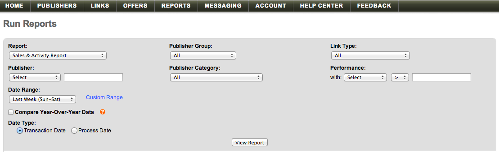

# 导入 [!DNL Linkshare] 数据

将您的 [!DNL Linkshare] 数据进入 [!DNL Adobe Commerce Intelligence]，您需要执行两项操作：

1. [在中导出Linkshare数据 ](#export)
1. [将电子表格上传到 [!DNL Commerce Intelligence]](../connecting-data/using-file-uploader.md)

## 从Linkshare导出数据 {#export}

1. 在您的 [!DNL Linkshare] 帐户，转到 **[!UICONTROL Reports** > **Run Reports].**

1. 在 `Report` 下拉列表，选择 **[!UICONTROL Sales & Activity Report]**.

1. 将所有其他下拉选项保留为默认选项。

1. 在 `Date Range` 下拉菜单中，选择任意选项(`Sun - Sat`， `Mon - Sun`)与匹配 `Start of Week` 中的设置 [!DNL Commerce Intelligence].

1. 清除 `Compare Year-Over-Year Data` 复选框。

1. 下 `Data Type`，选择 `Transaction Date`.

   

1. 单击 **[!UICONTROL View Report]**.

1. 单击 **[!UICONTROL Download]**.

   此时， `.csv` 文件并下载。

下载文件后，您可以将其上传到 [!DNL Commerce Intelligence] 使用 [`File Upload` 功能](../connecting-data/using-file-uploader.md).
