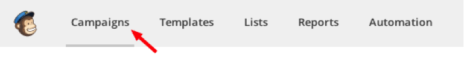
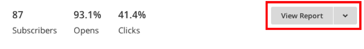
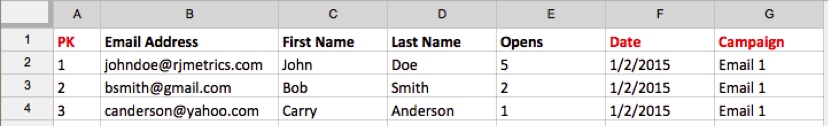
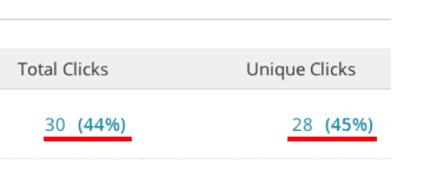
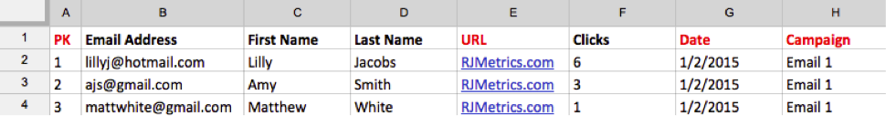
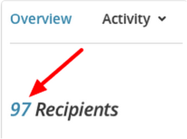
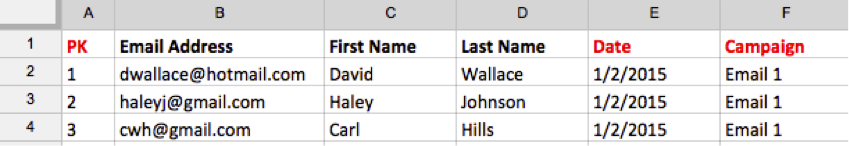

# 导入[!DNL Mailchimp]数据

要全面了解您的营销活动，您可以将[!DNL Mailchimp]电子邮件营销活动数据导入[!DNL Commerce Intelligence]。 要完成导入，您需要为每个[!DNL Mailchimp]营销活动执行以下操作：

## 导出打开数据 {#opens}

1. 登录[!DNL Mailchimp]后，转到`Campaigns`选项卡。

   

1. 单击营销活动名称旁边的&#x200B;**[!UICONTROL View Report]**。

   

1. 单击&#x200B;**[!UICONTROL Opened]**&#x200B;编号。

   

1. 单击&#x200B;**[!UICONTROL Export]**&#x200B;并保存`.csv`文件。

   您必须将`primary key`、`date (mm/dd/yyyy)`和`campaign name`列添加到此文件。 确保`primary keys`对于每一行都是唯一的。

   

## 导出点击量数据 {#clicks}

1. 导航回促销活动的`View Report`屏幕。

1. 单击`Clicked`的数字。

   

1. 单击`Total Clicks`或`Unique Clicks`列下的数字。

   

1. 单击&#x200B;**[!UICONTROL Export]**&#x200B;并保存`.csv`文件。

   您必须将`Primary Key`、`date (mm/dd/yyyy)`、`campaign name`和`URL`列添加到此文件。 您无需添加完整URL，只需添加一些可让您了解所单击内容的内容。

   

1. 对电子邮件中点击的每个URL重复步骤3和4，完成后，将所有数据合并到同一`.csv`文件中。

## 导出已发送数据 {#sent}

1. 进入[!DNL Mailchimp]的`Campaigns`选项卡。

1. 单击营销活动名称旁边的&#x200B;**[!UICONTROL View Report]**。

1. 单击`Recipients`旁边的数字。

   

1. 单击&#x200B;**[!UICONTROL Export]**&#x200B;并保存`.csv`文件。

   您必须将`Primary Key`、`date (mm/dd/yyyy)`和`campaign name`列添加到此文件。

   

## 准备上载到[!DNL Commerce Intelligence]的文件 {#upload}

每个文件（`Opens`、`Clicks`和`Sent`）都应作为单独的文件上载到[!DNL Commerce Intelligence]。 Adobe建议您使用以下命名约定来命名文件： `MailChimp\_ACTION\_DATE`。 将`ACTION`替换为`Open`、`Click`或`Sent`，并将`DATE`替换为导出日期。

当您准备好上载文件时，请使用[`File Upload`功能](../connecting-data/using-file-uploader.md)将数据导入您的Data Warehouse。
