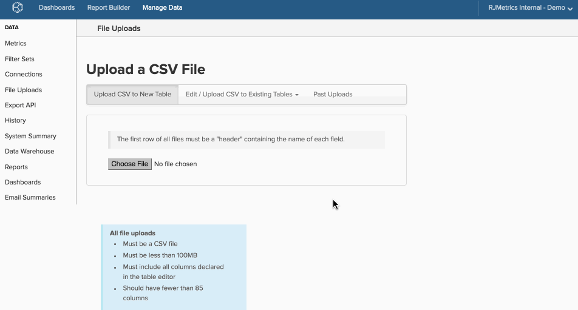
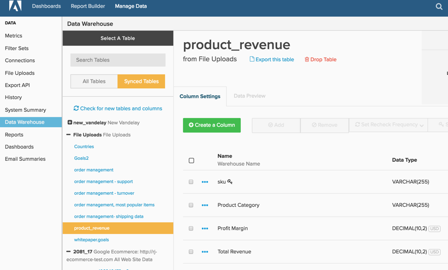

# 使用文件加载器

>[!NOTE]
>
>需要 [管理员权限](../../../administrator/user-management/user-management.md).

[!DNL MBI] 功能强大，不仅因为其可视化功能，还因为它允许您将所有数据放入一个data warehouse中。 即使数据库和集成之外的数据也可以引入 [!DNL MBI] 使用“Data warehouse管理器”中的文件上传工具。

让我们以广告促销活动为例。 如果您同时运行在线和离线营销活动，则如果您只分析来自在线集成的数据，则无法获得整体信息。 通过使用离线促销活动数据上传电子表格，可分析这两组数据，并更深入地了解促销活动效果。

## 限制和要求 {#require}

1. **文件上传唯一支持的格式是 `CSV` 或`comma separated values`**. 如果您在Excel中工作，则可以使用“另存为”功能将文件保存在 `.csv` 格式。
1. **`CSV`必须使用`UTF-8 encoding`**. 大多数情况下，这不会是问题。 如果您在上传文件时遇到此错误， [请参阅此支持文章](https://experienceleague.adobe.com/docs/commerce-knowledge-base/kb/troubleshooting/miscellaneous/resolving-utf-8-errors-for-csv-file-uploads.html?lang=en).
1. **文件不能大于100MB**. 如果文件大于此大小，请将表分成多个块，并将它们另存为单个文件。 可在加载初始文件后使用附加数据。
1. **所有表都必须具有`primary key`**. 表中至少需要有一列可用作 `primary key`，或表中每行的唯一标识符。 指定为 `primary key` can *从* 为空。 A `primary key` 可以像添加给每行指定数字的列一样简单，也可以是连接两列以创建唯一值的列(例如， `campaign name` 和 `date`)。

   如果列（或列）被指定为唯一，但存在重复项，则不会导入重复的行。

## 格式化要上传的数据 {#formatting}

在将数据上传到 [!DNL MBI]，请检查其格式是否符合此部分中的准则。

### 标题行 {#header}

为确保正确标记和导入列，请确保电子表格的第一行是描述每列数据的标题。

列名称必须唯一，并且只包含字母、数字、空格和这些符号： `$ % # /`. 如果列名称包含逗号，则在文件上载时，该列名称将被拆分为两列。 此外，我们建议文件中少于85列以优化更新速度。

### 带逗号的数据 {#commas}

因为文件必须在 `CSV` 格式，使用逗号可能会导致上载数据时出现问题。 `CSV` 文件使用逗号指示新值，因此列的名称类似于 `Campaigns`, `August` 将被读为两列(`Campaigns` 和 `August`)，而不是一行移动所有数据。 我们建议尽量避免使用逗号。 您可以使用 `Data Preview` 以查看更新完成后数据是否正确显示。

### 日期

包含日期的任何数据集都必须使用 [标准日期格式](https://dev.mysql.com/doc/refman/5.7/en/datetime.html) `YYYY-MM-DD HH:MM:SS` 或 `MM/DD/YYYY`.

### 特殊字符

某些特殊字符不被接受。 例如，管道符号 `& # 1 2 4` 被解释为创建新列，并且在上传文件时会导致错误。

### 小数

货币值应具有数据类型 `Decimal Number` ，并且这些列将自动四舍五入到您data warehouse中的小数位。 如果您不想对小数进行四舍五入或精度大于此值，则应选择 `Non-Currency Decimal Number` 数据类型。

### 百分比

百分比必须以小数形式输入。 例如：

| **对：** | **错误：** |
|-----|-----|
| `.05` | `5%` |
| `.23` | `23` |

{style=&quot;table-layout:auto&quot;}

### 具有前导和/或尾随零的值 {#zeroes}

文件中的某些值（如邮政编码和ID）可能以零开头或结尾。 为确保正确保留和上传零，您可以更改格式类型(例如， [从数字到文本](https://support.office.com/en-US/article/format-numbers-as-text-583160db-936b-4e52-bdff-6f1863518ba4))或强制执行数字格式。

让我们使用 `US ZIP codes` 作为如何更改数字格式的示例。 在 [!DNL Excel]，突出显示包含的列 `ZIP codes` 和 [更改数字格式](https://support.office.com/en-za/article/Display-numbers-as-postal-codes-61b55c9f-6fe3-4e54-96ca-9e85c38a5a1d) to `ZIP code`. 您还可以选择自定义数字格式，并在 `Type` 窗口，输入 `00000`. 请记住，如果某些代码的格式为 `00000` 其他 `00000-0000`.

的 `Type` 可以 [格式不同，以适应其他数据类型](https://support.office.com/en-us/article/Keep-leading-zeros-in-number-codes-1bf7b935-36e1-4985-842f-5dfa51f85fe7?CorrelationId=e1d4c2d3-cd5d-4a14-999d-437800274a90&amp;ui=en-US&amp;rs=en-US&amp;ad=US)，例如ID。 如果 `ID` 是9位数，例如 `Type` 可能 `000000000` 或 `000-000-000`. 这会改变 `123456` to `000-123-456`.

对于 [!DNL Google Docs] 和 [!DNL Apple Numbers] 资源，请参阅 [相关](#related) 列表。

## 上载数据 {#uploading}

现在，您的电子表格格式正确，并且 [!DNL MBI]-friendly，让我们将其添加到您的data warehouse。

1. 要开始配置，请转到 **[!UICONTROL Data** > **File Uploads]**.

1. 单击 **[!UICONTROL Upload to New Table]** 选项卡。

1. 单击 **[!UICONTROL Choose File]** 并选择文件。 单击 **[!UICONTROL Open]** 以开始上传。

   上传完成后，您将看到列列表 [!DNL MBI] 在文件中找到。

1. 检查列名称和数据类型是否正确。 具体而言，请检查是否将任何日期列读作日期，而不是数字。

   >[!NOTE]
   >
   >的 `datatype` 非常重要，因此请勿跳过此步骤！

1. 选择将构成 `primary key` 复选框（使用键图标下的复选框）。

1. 命名表。

1. 单击 **[!UICONTROL Save Table]**.

A *成功！* 保存表后，屏幕顶部会显示消息。

如果您需要视觉，请查看以下整个过程：

上传的表显示在 **文件上传** 表列表的部分(在“Data warehouse管理器”的“所有表”和“同步的表”选项中):

## 更新数据或将数据附加到现有表 {#appending}

是否有新数据要添加到您已上传的文件？ 无问题 — 您可以轻松地更新数据并将其附加到 [!DNL MBI].

1. 要开始配置，请转到 **[!UICONTROL Manage Data** > **File Uploads]**.

1. 单击 **[!UICONTROL Edit/Upload `.csv`到现有表]** 选项卡。

1. 在下拉菜单中，单击要更新或附加的表的名称。

1. 使用下拉菜单选择用于处理重复行的选项：

   |  |  |
   |---|---|
   | `Overwrite old row with new row` | 如果行与现有表和新文件中的主键相同，则这将使用新数据覆盖现有数据。 这是用于值随时间变化的列（例如，状态列）的方法。 现有数据将被覆盖并更新为新数据。 现有表中没有主键的行将作为新行添加。 |
   | `Retain old row; discard new row` | 如果行与现有表和新文件中的主键相同，则这会导致忽略新数据。 |
   | `Purge all existing rows first and ignore duplicate keys within the file` | 这将删除任何现有数据，并将其替换为来自文件的新数据。 仅当您不需要现有表中的任何数据时，才应使用此选项。 |

1. 单击 **[!UICONTROL Choose File]** 并选择文件。

1. 单击 **[!UICONTROL Open]** 以开始上传。

   上传完成后， [!DNL MBI] 将验证文件中的数据结构。 A *成功！* 保存表后，屏幕顶部会显示消息。

## 数据可用性 {#availability}

与计算列一样，文件上载的数据在下一个更新周期完成后也可用。 如果在文件上传期间进行了更新，则在下次更新之后，数据才可用。 完成更新周期后，您可以导航到 `Data Preview` 选项卡，以确保文件已正确上传，并且数据可按预期显示。

## 包装 {#wrapup}

本文仅介绍了使用导入数据的基础知识，但我们打赌您希望执行一些更高级的操作。 查看相关文章，以获取有关格式化和导入金融、电子商务、广告支出及其他类型数据的指导。

此外，文件上传并不是将数据导入的唯一方法 [!DNL MBI]. 的 [数据导入API](https://developer.adobe.com/commerce/services/reporting/import-api/) 函数允许您将任意数据推送到 [!DNL MBI] data warehouse。

## 相关 {#related}

* [格式化和导入财务数据](../../../best-practices/format-import-financial-data.md)
* [导入离线/其他广告支出数据](../connecting-data/import-offline-ad-data.md)
* [预期[!DNL Google ECommerce] 数据](../integrations/google-ecommerce-data.md)

## 第三方资源

* [数字数据格式指南](http://www.dummies.com/how-to/content/how-to-choose-a-number-format-in-your-numbers-spre.html)
* [[!DNL Google Docs] Data Formatting指南](https://support.google.com/docs/answer/56470?hl=en)
