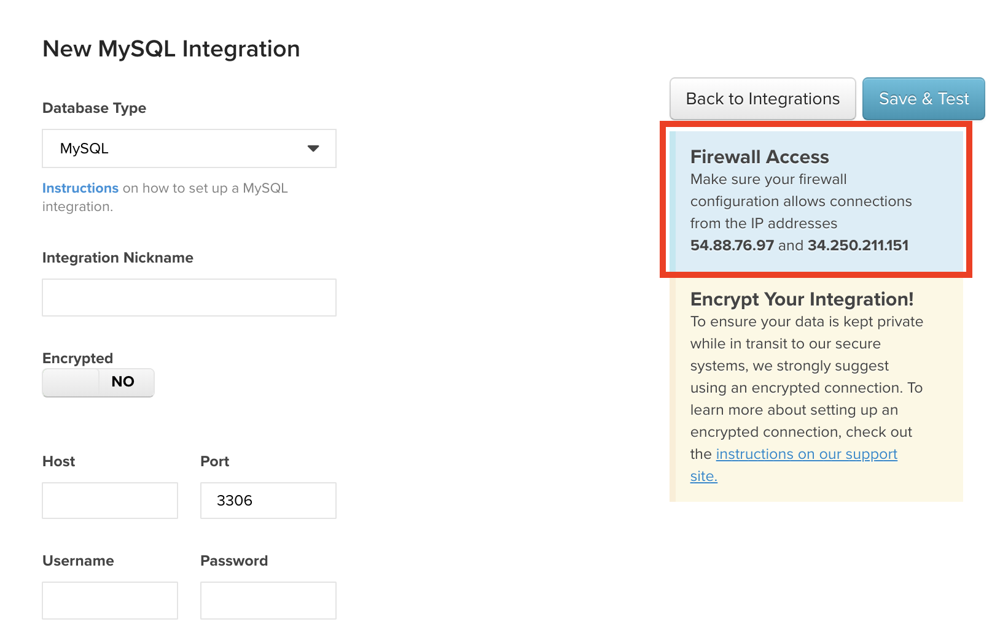

# 连接[!DNL Amazon RDS]

[!DNL Amazon Relational Database Services (RDS)]是在您可能已经熟悉的数据库引擎上运行的托管数据库服务：

* [[!DNL MySQL]](../integrations/mysql-via-a-direct-connection.md)
* [[!DNL Microsoft SQL]](../integrations/microsoft-sql-server.md)
* [[!DNL PostgreSQL]](../integrations/postgresql.md)

根据您使用的数据库类型以及您是否使用加密连接（如[`SSH tunnel for MySQL`](../integrations/mysql-via-ssh-tunnel.md)），连接[!DNL RDS]实例的步骤有所不同，但以下是基础知识。

## 授权[!DNL Commerce Intelligence]访问您的数据库

在每个数据库的凭据页面(**[!UICONTROL Manage Data** > **Integrations]**)上，您会看到一个包含必须授权才能将R[!DNL RDS]连接到[!DNL Commerce Intelligence]的IP地址的框： `54.88.76.97`和`34.250.211.151`。 以下是`MySQL credentials`页面上的内容，在该页面上，您突出显示了IP地址框：

要使[!DNL Commerce Intelligence]成功连接到[!DNL RDS]实例，必须通过AWS管理控制台将这些IP地址添加到相应的数据库安全组。 可以将这些IP地址添加到现有组，也可以创建一个IP地址 — 重要的是，该组有权访问您要连接到[!DNL Commerce Intelligence]的实例。

添加[!DNL Commerce Intelligence] IP地址时，请确保将`/32`添加到地址的末尾，以指示[!DNL Amazon]它是精确的IP地址。 不用担心，AWS界面会明确说明这是必需的。

## 为[!DNL Commerce Intelligence]创建一个`Linux`用户 {#linux}

>[!NOTE]
>
>仅当使用加密连接时，才需要执行此步骤。 有关如何执行此操作的说明，请参阅正在使用的数据库的设置主题（例如：MySQL）。 `Linux`用户允许我们创建`SSH tunnel`，这是通过Internet发送数据的最安全方法。

## 为[!DNL Commerce Intelligence]创建数据库用户

这是该过程的一部分，根据您使用的数据库，步骤会有所不同。 不过，您为[!DNL Commerce Intelligence]创建了一个用于访问数据库的用户，其想法是相同的。 有关创建数据库[!DNL Commerce Intelligence]用户的说明，请参阅您正在使用的数据库的设置主题。

## 在[!DNL Commerce Intelligence]中输入连接信息

在您授予实例的[!DNL Commerce Intelligence]访问权限并为我们创建用户后，您最后需要做的就是在[!DNL Commerce Intelligence]中输入连接信息。

通过单击&#x200B;**[!UICONTROL Add Integration]**，可通过`Integrations`页面(**[!UICONTROL Manage Data** > **Integrations]**)访问`MySQL`、`Microsoft SQL`和`PostgreSQL`的凭据页面。 显示集成列表后，单击要用于转至身份证明页的数据库的图标。 如果您当前无权访问所需的集成，请联系您的Adobe客户团队。

要完成连接创建，您需要以下信息：

* RDS实例的公用地址：可在[!DNL AWS]管理控制台中找到。
* 数据库实例使用的端口：某些数据库具有默认端口，该端口会自动填充`Port`字段。 还可以在数据库的设置文档中找到此信息。
* 您为[!DNL Commerce Intelligence]创建的用户的用户名和密码。

如果您使用的是加密连接，请将数据库凭据页面上的`Encrypted`切换更改为`Yes`。 这将显示一个用于设置加密的额外表单：

