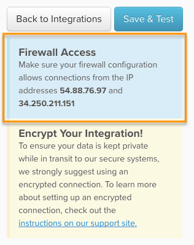

# 通过VPN连接数据库

虽然我们建议您使用SSH通道连接数据库，但您也可以使用加密的VPN连接来保证数据库的安全。 A `VPN` 可用于任何数据库集成，为了简单起见，该过程与设置 `SSH tunnel`:

1. [创建 [!DNL MBI] 数据库用户](#database)
1. [创建 [!DNL MBI] VPN用户](#vpn)
1. [允许访问 [!DNL MBI] IP地址](#allowlist)
1. [在MBI中输入连接和VPN用户信息](#finish)

除了数据库凭据之外，您还必须输入VPN用户的凭据才能将其包装起来。 任何VPN用户都能正常工作，但我们建议您创建 [!DNL MBI] 用户 — 这样您便于跟踪帐户中的用户。

让我们开始吧。

## 为创建数据库用户 [!DNL MBI] {#database}

创建数据库用户的过程将因您连接的数据库类型而异。 要查看每种数据库类型的说明，请单击以下链接。

* [Microsoft SQL](../integrations/microsoft-sql-server.md)
* [MongoDB](../integrations/databases-via-a-vpn.md)
* [MySQL](../integrations/mysql-via-a-direct-connection.md)
* [PostgreSQL](../integrations/postgresql.md)

## 创建 `VPN` 用户 [!DNL MBI] {#vpn}

如前所述，任何有效 `VPN` 用户将有效 — 但我们强烈建议您仅为 [!DNL MBI] 使用。

## 允许访问 [!DNL MBI] IP地址 {#allowlist}

要使连接成功，您必须配置防火墙以允许从我们的IP地址访问。 是 `54.88.76.97` 和 `34.250.211.151`，但也在 `credentials` 用于任何数据库集成的页面：

## 进入连接并 `VPN` 用户信息到 [!DNL MBI] {#finish}

总结一下，我们需要在 [!DNL MBI]. 你离开数据库了吗 `credentials` 页面打开？ 如果没有，请转到 **[!UICONTROL Manage Data** > **Connections]** 单击 **[!UICONTROL Add New Data Source]**，然后是所连接数据库的图标。 不要忘记改变 `Encrypted` 切换至 `Yes`.

在此页面中输入以下信息(从 `Database Connection` 部分：

* `Username`:的用户名 [!DNL MBI] 数据库用户
* `Password`:的密码 [!DNL MBI] 数据库用户
* `Port`:服务器上数据库的端口。 默认值为：
* `MicrosoftSQL`: `1433`
* `MongoDB`: `27017`
* `MySQL`: `3306`
* `PostgreSQL`: `5432`
* `Host`:默认情况下，这将为localhost `127.0.0.1`，但也可能是您服务器的公共IP地址或局域网地址。
* `Database Name (optional)`:如果仅允许访问一个数据库（在数据库用户创建步骤中指定），请在此处输入该数据库的名称。

在 `Encryption Connection` 部分：

* `Encryption Type`:将此参数设置为 `Cisco IPsec VPN`
* `Gateway Address`:VPN服务器的IP地址
* `Group Name`:用于组身份验证的组的名称
* `Group Secret`:与组对应的密码。
* `Username`:的 [!DNL MBI] `VPN` 用户名
* `Password`:的 [!DNL MBI] `VPN` 用户密码

就这样！ 完成后，单击 **[!UICONTROL Save & Test]** 以完成设置。
