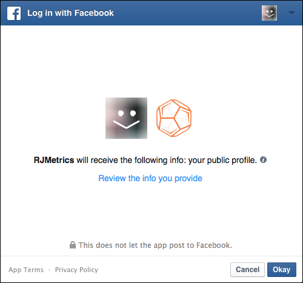

# 连接 [!DNL Facebook Ads]

>[!NOTE]
>
>需要 [管理员权限](../../../administrator/user-management/user-management.md).

你做了调查，制作了广告，在 [!DNL Facebook]. 现在，该分析您的广告支出数据并查看您的资金是否得到有效使用了。 使用您的广告支出数据，您可以 [通过将广告成本与客户生命周期价值(CLV)相结合来衡量促销活动ROI](../../../data-analyst/analysis/roi-ad-camp.md) 从您的营销活动获得的用户数量。

将Facebook广告数据连接到 [!DNL MBI] 是一个简单的三步流程：

1. [添加 [!DNL Facebook] 作为 [!DNL MBI]](#stepone)
1. [允许 [!DNL MBI] 访问 [!DNL Facebook Ads] 数据](#steptwo)
1. [选择 [!DNL Facebook Ads] 用于提取数据的帐户](#stepthree)

## 添加 [!DNL Facebook] 作为 [!DNL MBI] {#stepone}

1. 添加 [!DNL Facebook] 集成到您的帐户，导航到 `Connections` 页面下 **[!UICONTROL Manage Data** > **Integrations]**.
1. 单击 **[!UICONTROL Add Integration]**，位于数据上方屏幕右侧 `Sources` 表。
1. 单击 [!DNL Facebook] 图标。 这将显示 [!DNL Facebook] 授权页面。
1. 单击 **[!UICONTROL Authorize]**.

## 允许 [!DNL MBI] 访问 [!DNL Facebook Ads] 数据 {#steptwo}

单击 **[!DNL Facebook Authorize]**，将显示一个小弹出窗口：

您将执行一系列步骤以允许 [!DNL MBI] 要从您的公共配置文件访问数据， [!DNL Facebook Ads] 和相关统计资料。 单击 **[!UICONTROL OK]** 继续执行这些步骤。

## 选择 [!DNL Facebook Ads] 用于提取数据的帐户 {#stepthree}

1. 验证完成后，系统将提示您选择 [!DNL Facebook Ads] 要从中提取数据的帐户。 单击 `Connect` 列。

   

1. 单击 **[!UICONTROL Save Connections]**.

   如果连接成功，则 *连接成功！* 消息将显示在页面顶部。

## 接下来是什么？ {#next}

确保跟踪 [!DNL Facebook] 营销活动 [!DNL Google Analytics] 根据 [教程](https://www.facebook.com/business/google-analytics). 这将确保 `utm\_campaign` 字段 [!DNL Google Analytics] 正确填充了 [!DNL Facebook] 营销活动。

## 相关

* [重新验证集成](https://support.magento.com/hc/en-us/articles/360016733151)
* [连接 [!DNL Google Adwords] 帐户](../integrations/google-ecommerce.md)
* [通过跟踪订单反向链接来源 [!DNL Google eCommerce]](../integrations/google-ecommerce.md)
* [跟踪数据库中的用户反向链接源](../../analysis/google-track-user-acq.md)
* [跟踪数据库中的用户设备、浏览器和操作系统数据](../../analysis/track-usr-dev-browser.md)
* [发现最有价值的客户获取来源和渠道](../../analysis/most-value-source-channel.md)
* [提高广告活动的ROI](../../analysis/roi-ad-camp.md)
* [如何 [!DNL Google Analytics] UTM归因工作？](../../analysis/utm-attributes.md)
