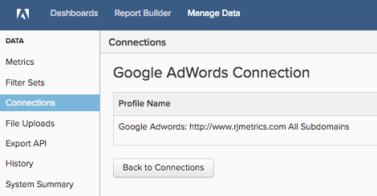

# 连接 [!DNL Google Adwords]

>[!NOTE]
>
>需要 [管理员权限](../../../administrator/user-management/user-management.md).

你做了调查，制作了广告，启动了营销活动。 现在，该分析您的广告支出数据并查看您的资金是否得到有效使用了。 使用您的广告支出数据，您可以 [通过将广告成本与客户生命周期价值(CLV)相结合来衡量促销活动ROI](../../analysis/roi-ad-camp.md) 从您的营销活动获得的用户数量。

让我们从进入 [!DNL Google Adwords] 凭据 [!DNL MBI]:

1. 转到 **管理数据>集成**.
1. 单击 **添加集成**，位于屏幕的右上方。
1. 单击 **[!DNL Google Adwords]** 图标。 这将打开 [!DNL Google Adwords] 凭据页面。
1. 输入 [!DNL Google Analytics] 凭据。 授权过程完成后，您将被重定向回 [!DNL MBI].
1. 将显示配置文件ID列表。 检查要连接的用户档案 [!DNL MBI].

   

1. 更改将自动保存，因此单击 **[!UICONTROL Back to Connections]** 等你完成。

如果您有多个用户档案，并且需要一些帮助来确定哪个是用户档案，请参阅 `Connecting Multiple Google Analytics profiles` 部分。

## `Connecting multiple Google Analytics profiles`

您可能有多个网站连接到一个网站 [!DNL Google Analytics] 帐户，由其自己标识 [!DNL Google Analytics] 配置文件ID。 在这种情况下，您可以选择在 [!DNL MBI]. 只需在用户档案选择步骤中检查要包含的用户档案ID即可。

**要识别特定网站的Google Analytics配置文件ID，请执行以下操作：**

1. 登录 [!DNL Google Analytics]
1. 转到特定网站的 [!DNL Google Analytics] 仪表板
1. 查看URL — 配置文件ID对应于以下8个数字 `p` 在行末：

   `www.google.com/analytics/web/#home/a11345062w43527078p**XXXXXXXX**`

## 断开连接 [!DNL Google Adwords]

1. 访问 [!DNL Google] [帐户设置](https://www.google.com/accounts/) 页面。
1. 在 `Security` ，然后单击 **[!UICONTROL edit]** 下一页 `Authorizing` 应用程序和站点。
1. 单击 **[!UICONTROL revoke access]** 下一页 [!DNL MBI].

## 相关

* [重新验证集成](https://support.magento.com/hc/en-us/articles/360016733151)
* [通过跟踪订单反向链接来源 [!DNL Google ECommerce]](../integrations/google-ecommerce.md)
* [跟踪数据库中的用户反向链接源](../../analysis/google-track-user-acq.md)
* [跟踪数据库中的用户设备、浏览器和操作系统数据](https://support.magento.com/hc/en-us/articles/360016732911)
* [发现最有价值的客户获取来源和渠道](../../analysis/most-value-source-channel.md)
* [提高广告活动的ROI](../../analysis/roi-ad-camp.md)
* [如何 [!DNL Google Analytics] UTM归因工作？](../../analysis/utm-attributes.md)
