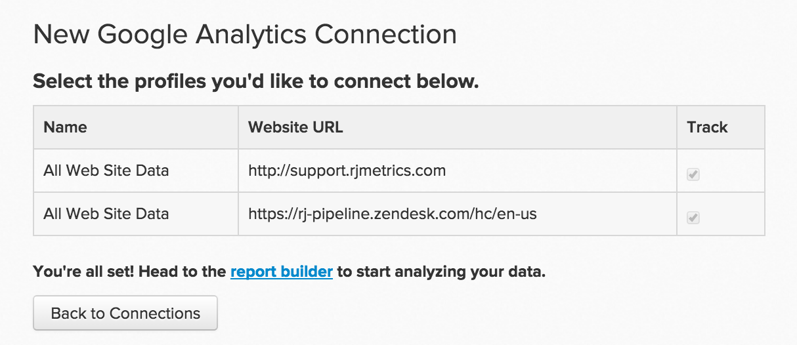

# 连接[!DNL Google Analytics]

>[!NOTE]
>
>需要[管理员权限](../../../administrator/user-management/user-management.md)。

[!DNL Google Analytics]是Internet上使用最广泛的Web分析服务。 通过在您的网站上实施[!DNL Google Analytics]，您可以跟踪访客如何使用您的网站、哪些内容吸引人、访客的退出位置等。 在[!DNL Commerce Intelligence]中连同其他数据一起分析这些量度，可提高网站的整体运行状况和可用性。

在[!DNL Google Analytics]中输入您的[!DNL Commerce Intelligence]凭据以开始操作：

1. 转到&#x200B;**[!UICONTROL Manage Data** > **Integrations]**。

1. 单击屏幕右侧的&#x200B;**[!UICONTROL Add Integration]**。

1. 单击[!DNL Google Analytics]图标。 这将打开[!DNL Google Analytics]凭据页面。

1. 输入您的[!DNL Google Analytics]凭据。 授权过程完成后，您将被重定向回[!DNL Commerce Intelligence]。

1. 此时将显示配置文件ID列表。 检查要连接到[!DNL Commerce Intelligence]的配置文件。 如果您有多个配置文件并且需要帮助来识别哪个，请参阅下面的“连接多个[!DNL Google Analytics]配置文件”部分。

   <!--{: width="600px"}-->

1. 更改会自动保存，因此完成时请单击&#x200B;**返回连接**。

## 连接多个[!DNL Google Analytics]配置文件

您可能将多个网站连接到单个[!DNL Google Analytics]帐户，并使用其自己的[!DNL Google Analytics]配置文件ID进行标识。 在这种情况下，您可以选择在[!DNL Commerce Intelligence]中包含您的所有配置文件ID。 检查要在用户档案选择步骤中包含的用户档案ID。

要识别特定网站的[!DNL Google Analytics]配置文件ID，请执行以下操作：

1. 登录[!DNL Google Analytics]
1. 转到特定网站的[!DNL Google Analytics]仪表板
1. 查看URL — 配置文件ID对应于行末尾位于`p`后面的八个数字：

   `www.google.com/analytics/web/#home/a11345062w43527078p**XXXXXXXX**/`

## 正在断开[!DNL Google Analytics]与[!DNL Commerce Intelligence]的连接 {#disconnect}

1. 访问您的[!DNL Google Analytics] [帐户设置](https://accounts.google.com/)页面。
1. 在`Security`部分下，单击&#x200B;**[!UICONTROL edit]**&#x200B;应用程序和站点旁边的`Authorizing`。
1. 单击&#x200B;**[!UICONTROL revoke access]**&#x200B;旁边的[!DNL Commerce Intelligence]。

## 相关：

* [正在重新验证集成](https://experienceleague.adobe.com/docs/commerce-knowledge-base/kb/how-to/mbi-reauthenticating-integrations.html?lang=zh-Hans)
* [正在连接 [!DNL Google Adwords]](../integrations/google-adwords.md)
* [分析网站活动和客户转化率](../../analysis/web-act-cust-conversion.md)
* [使用 [!DNL Google Analytics] Cookie跟踪用户获取数据](../../analysis/google-track-user-acq.md)
