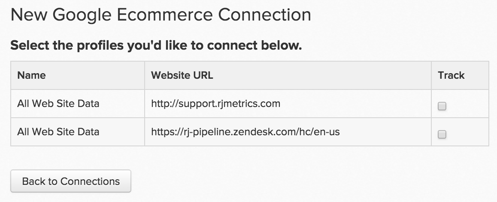

# 连接 [!DNL Google ECommerce]

>[!NOTE]
>
>需要 [管理员权限](../../../administrator/user-management/user-management.md).

流量和订单流量稳定，这意味着您能够有效地联系和吸引客户。 但您最有价值的推荐渠道是什么？ 从一个来源获得的客户与从另一个来源获得的客户的平均生命周期值是多少？ 通过从以下位置连接订单引荐源数据 [!DNL Google ECommerce] to [!DNL MBI]，则可以构建分析以帮助您识别 [最有价值的营销渠道](../../../data-analyst/analysis/most-value-source-channel.md).

让我们从进入 [!DNL Google ECommerce] 凭据 [!DNL MBI]:

1. 转到 `Connections` 页面下 **[!UICONTROL Admin** > **Connections]**.
1. 单击 **[!UICONTROL Add a New Source]**，位于屏幕右侧，位于 `Data Sources` 表。
1. 单击 [!DNL Google ECommerce] 图标。 这将打开 [!DNL Google ECommerce] 凭据页面。
1. 输入 [!DNL Google Analytics] 凭据。 授权过程完成后，您将被重定向回 [!DNL MBI].
1. 将显示配置文件ID列表。 检查要连接的用户档案 [!DNL MBI].

   如果您有多个用户档案，并且需要一些帮助来确定哪个是用户档案，请参阅**连接多个 [!DNL Google Analytics] 用户档案部分。

   <!--{: width="500"}-->

1. 更改会自动保存，因此只需单击 **[!UICONTROL Back to Connections]** 完成。

## 连接多个 [!DNL Google Analytics] 用户档案 [!DNL MBI]

您可能有多个网站连接到一个网站 [!DNL Google Analytics] 帐户，由其自己标识 [!DNL Google Analytics] 配置文件ID。 在这种情况下，您可以选择在 [!DNL MBI]. 只需检查要在用户档案选择步骤中包含的用户档案ID即可。

确定特定网站的 [!DNL Google Analytics] 配置文件ID:

1. 登录 [!DNL Google Analytics]
1. 转到特定网站的 [!DNL Google Analytics] 仪表板
1. 查看URL — 配置文件ID对应于以下8个数字 `p` 在行尾

   `www.google.com/analytics/web/#home/a11345062w43527078p**XXXXXXXX**/`

## 断开连接 [!DNL Google ECommerce] 从 [!DNL MBI] {#disconnect}

1. 访问 [!DNL Google Analytics] [帐户设置](https://www.google.com/accounts/) 页面。
1. 在 `Security` ，单击 **[!UICONTROL edit]** 下一页 `Authorizing` 应用程序和站点。
1. 单击 **[!UICONTROL revoke access]** 下一页 [!DNL MBI].

## 相关：

* [预期 [!DNL Google ECommerce] 数据](../integrations/google-ecommerce-data.md)
* [重新验证集成](https://support.magento.com/hc/en-us/articles/360016733151)
* [设置 [!DNL Google ECommerce] 跟踪](https://support.google.com/analytics/answer/1009612?hl=en)
* [发现最有价值的客户获取来源和渠道](../../analysis/most-value-source-channel.md)
* [提高广告活动的ROI](../../analysis/roi-ad-camp.md)
