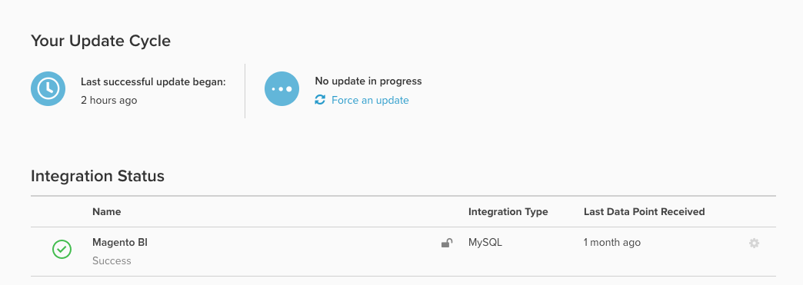

# 数据库结果与 [!DNL SQL Editor] 结果

你可能会好奇 `Last successful update began` 字段在您的 `Integrations` 页面：

## 了解 `timestamp` 字段

它显示了开始 `timestamp` （在您帐户中设置的时区内） _上次成功更新周期_ 在您的帐户上。

- 如果任何同步的表在上次更新周期中遇到问题，则此时间戳为 *未更新*.
- 因此，在某些情况下，报告可能已使用新数据进行了更新，但是 *上次成功更新已开始* 仍然滞后。

## 识别“真正的”最后一个数据点

特定集成的最新数据点由 `Last Data Point Received` 时间戳位于每个集成的右侧。 该时间戳是指您的Data Warehouse上次成功从该源接收数据点的时间，无论该源是数据库、API还是第三方集成。

检查来自以下位置的数据的时效性： *特定表*，Adobe建议快速创建 [[!DNL SQL] 报告](../../dev-reports/sql-rpt-bldr.md) 执行 `MAX(timestamp)` 在您帐户中最重要的表格上。 将此时间戳与 `Last Data Point` 指示问题影响整个帐户还是表的子集。 Adobe建议对三到四个常用重要表执行此操作。

- 如果 `MAX(timestamp)` 值比 `Last Data Point Received`，这意味着一部分表受到影响，但整个帐户的更新周期是稳定的。
- 如果 `MAX(timestamp)` 值等于或早于 `Last Data Point Received`，这意味着帐户的更新周期受到影响。 这种情况下 [提交支持服务单](https://experienceleague.adobe.com/docs/commerce-knowledge-base/kb/troubleshooting/miscellaneous/mbi-service-policies.html).
