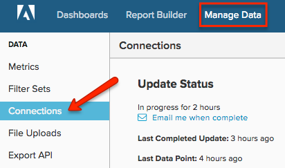

# 连接[!DNL Microsoft SQL]服务器

>[!NOTE]
>
>需要[管理员权限](../../../administrator/user-management/user-management.md)。

本主题介绍如何在四步流程中将您的[!DNL Microsoft SQL]数据库连接到[!DNL Commerce Intelligence]。 此过程需要与服务器连接和SQL相关的一些技术专业知识，并且可能需要团队开发人员的支持。

[!DNL Commerce Intelligence]支持[!DNL Amazon RDS]、[!DNL EC2]、[!DNL Microsoft SQL Azure]和大多数其他云服务器提供程序。 如果您对特定主机有疑问，请[提交支持票证](https://experienceleague.adobe.com/docs/commerce-knowledge-base/kb/troubleshooting/miscellaneous/mbi-service-policies.html?lang=zh-Hans)，要求我们提供此信息。

您的系统需要对数据库运行SELECT查询。 这最初是为了获取数据库结构的快照，然后定期超时以保持数据最新。 您的更新是增量式的，Adobe会限制更新频率和时间，以防止服务器上出现任何不需要的负载。

最佳方法是我们通过TCP/IP连接到您的数据库服务器。 为我们创建一个只能运行SELECT查询的用户（也可以选择只从您指定的表中选择数据）。 必须为您连接到[!DNL Commerce Intelligence]的每个服务器执行此操作。

## 正在将`Microsoft SQL`连接到[!DNL Commerce Intelligence]：

1. 确保您的服务器允许通过TCP/IP和混合模式身份验证进行连接。

1. 确保您的防火墙允许服务器的专用IP进行连接。

   您可以在`Settings`页面的连接部分中找到用于连接到服务器的IP地址。

1. 创建用于登录到数据库服务器的用户。 您有两个选项；通过`UI`或通过`query`：
   * `UI`
   * [`Query`](http://sqlserverplanet.com/security/add-user) （第二个示例）

1. 在&#x200B;**[!UICONTROL Manage Data** > **Connections]**&#x200B;下的[!DNL Commerce Intelligence]中输入服务器IP地址、用户名和密码。

   

1. 单击&#x200B;**[!UICONTROL Add a Data Source]**。

1. 选择以连接`Microsoft SQL`数据库，并在新`Connections`页上的字段中输入您的凭据。

   如果您使用的是`Windows Azure`，则还必须指定数据库名称。
