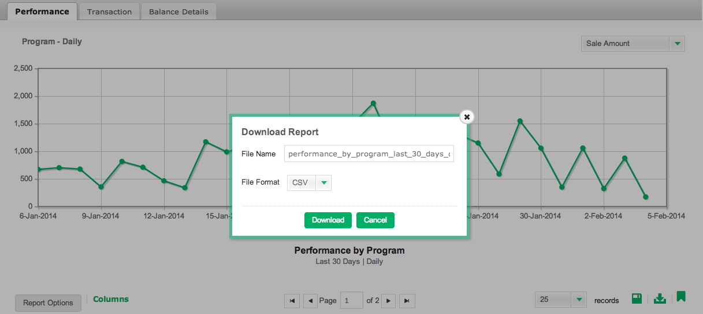

# [!DNL Mixpanel]中的数据验证

当[!DNL Adobe Commerce Intelligence]首次连接到您的[!DNL Mixpanel]数据时，您的客户经理或分析师可能会请求您从[!DNL Mixpanel]提供数据导出以进行验证。 这允许您确认已同步直接在[!DNL Mixpanel]内对您可用的所有数据。

## 数据导出过程： `Events`

1. 访问您的`Segmentation`分区并查看`Your Top Events`。

   

1. 为时间范围选择`Past 96 Hours`

   

1. 滚动到报告的右下部分并导出`.csv`文件：

   

1. 将`.csv`文件发送给在此验证过程中与您合作的客户经理或分析师。
