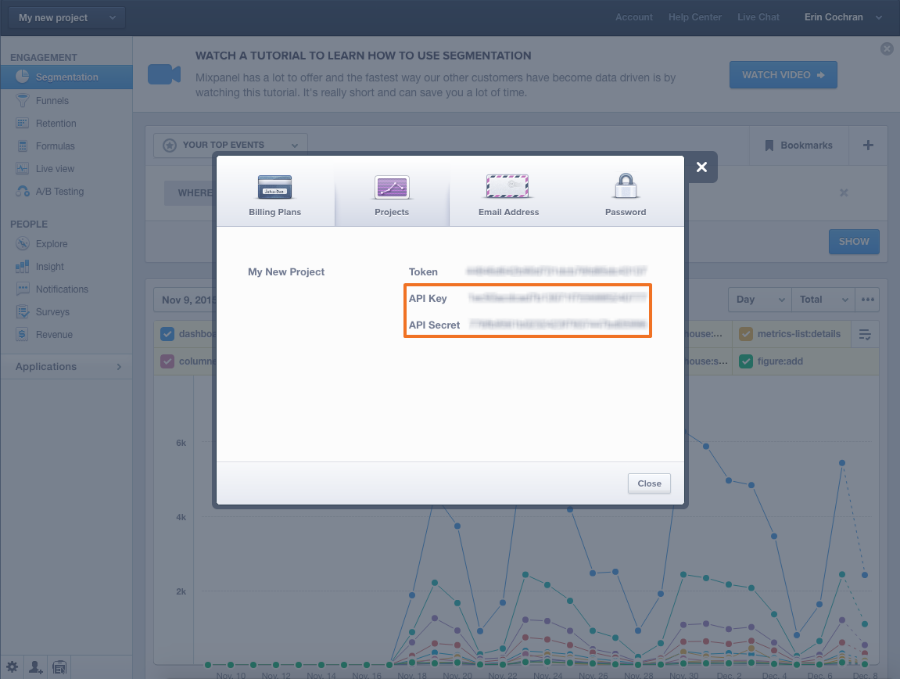

# 连接 [!DNL Mixpanel]

>[!NOTE]
>
>需要 [管理员权限](../../../administrator/user-management/user-management.md).

使用 [!DNL Mixpanel]，您可以分析用户如何导航和利用您的网站和应用程序。 仔细查看用户行为数据可带来更智能的设计和开发决策，这意味着总体产品会更好。 连接 [!DNL Mixpanel] to [!DNL MBI] 可让您分析用户的行为方式以及该行为如何转化为收入。

连接 [!DNL Mixpanel] 数据到 [!DNL MBI] 一个简单的三步流程：

1. [打开 [!DNL Mixpanel] 凭据页面 [!DNL MBI]](#stepone)
1. [检索 [!DNL Mixpanel] API凭据](#steptwo)
1. [输入 [!DNL Mixpanel] MBI中的API凭据](#stepthree)

要完成此过程，您需要打开两个浏览器窗口或选项卡 — 一个用于 [!DNL MBI]，另一个用于 [!DNL Mixpanel] 帐户。

## 打开 [!DNL Mixpanel] 凭据页面 {#stepone}

让我们开始吧：

1. 转到 `Connections` 页面下 **[!DNL Manage Data** > **Connections]**.
1. 单击 **[!UICONTROL Add a New Source]**，位于屏幕右侧，位于 `Data Sources` 表。
1. 单击 [!DNL Mixpanel] 图标，此时将打开凭据页面。

暂时保持此页面打开状态，并使用 [!DNL Mixpanel] 帐户。

## 检索 [!DNL Mixpanel] API凭据 {#steptwo}

如果您尚未登录 [!DNL Mixpanel] 帐户，请执行此操作，然后执行以下操作：

1. 单击 **[!UICONTROL Account]** 中。
1. 在显示的对话框中，单击 **[!UICONTROL Projects]**.
1. 将显示您的API凭据：

保持打开 — 我们需要它来结束。

## 进入 [!DNL Mixpanel] 中的API凭据 [!DNL MBI] {#stepthree}

1. 复制 `API Key` 和 `Secret` 到 [!DNL Mixpanel] 凭据页面 [!DNL MBI].
1. 单击 **[!UICONTROL Connect to Mixpanel]** 以完成设置。

就这样！ 如果连接成功，则 _成功！_ 消息将显示在页面顶部。

### 相关

* [预期 [!DNL Mixpanel] 数据](../integrations/mixpanel-data.md)
* [重新验证集成](https://support.magento.com/hc/en-us/articles/360016733151)
