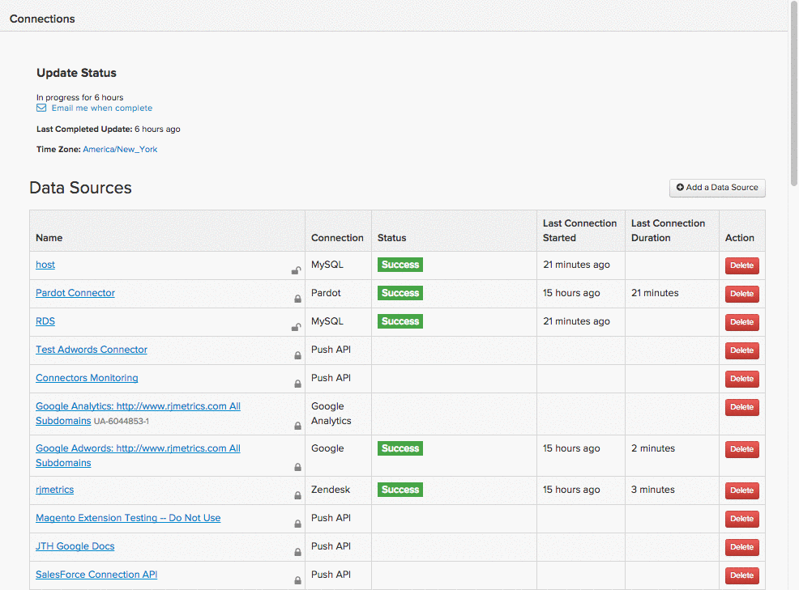

# Connect [!DNL MongoDB] 通过SSH通道

连接您的 [!DNL MongoDB] 数据库至 [!DNL Commerce Intelligence] 通过SSH隧道，您必须执行以下操作：

1. [检索 [!DNL Commerce Intelligence] 公钥](#retrieve)
1. [允许访问 [!DNL Commerce Intelligence] IP地址](#allowlist)
1. [创建用于Commerce Intelligence的Linux用户](#linux)
1. [创建 [!DNL MongoDB] commerce Intelligence用户](#mongodb)
1. [将连接和用户信息输入到 [!DNL Commerce Intelligence]](#finish)

>[!NOTE]
>
>由于此设置的技术性质，Adobe建议您在开发人员中循环以帮助您解决以前是否未执行此设置的问题。

## 正在检索 [!DNL Commerce Intelligence] 公钥 {#retrieve}

此 `public key` 用于授权 [!DNL Commerce Intelligence] `Linux` 用户。 下一部分将指导您完成创建用户和导入密钥的过程。

1. 转到 **[!UICONTROL Data** > **Connections]** 并单击 **[!UICONTROL Add New Data Source]**.
1. 单击 [!DNL MONGODB] 图标。
1. 在 [!DNL MongoDB] “凭据”页面打开，更改 `Encrypted` 切换到 `Yes`. 这将显示SSH设置表单。
1. 此 `public key` 位于此表单下。

在整个教程中保持此页面处于打开状态 — 您需要在下一部分和结尾处打开此页面。

如果您有点儿迷路，下面是如何浏览的 [!DNL Commerce Intelligence] 要检索密钥，请执行以下操作：

<!--{:.zoom}-->

## 允许访问 [!DNL Commerce Intelligence] IP地址 {#allowlist}

要使连接成功，必须将防火墙配置为允许从IP地址访问。 它们是 `54.88.76.97` 和 `34.250.211.151`，但它也位于 [!DNL MongoDB] “身份证明”页：


## 创建 `Linux` 用户 [!DNL Commerce Intelligence] {#linux}

>[!IMPORTANT]
>
>如果 `sshd_config` 与服务器关联的文件未设置为默认选项，仅某些用户具有服务器访问权限 — 这会阻止成功连接到 [!DNL Commerce Intelligence]. 在这些情况下，必须运行命令，例如 `AllowUsers` 以允许 `rjmetric` 用户对服务器的访问权限。

这可以是生产或辅助计算机，只要它包含实时（或经常更新）数据即可。 您可以按您喜欢的方式限制此用户，只要它保留连接到 [!DNL MongoDB] 服务器。

要添加新用户，请以root用户身份在 `Linux` 服务器：

```bash
    adduser rjmetric -p
    mkdir /home/rjmetric
    mkdir /home/rjmetric/.ssh
```

记住 `public key` 你是在第一节中找回的吗？ 要确保用户有权访问数据库，您需要将密钥导入 `authorized_keys`. 将整个密钥复制到 `authorized_keys` 文件如下所示：

```bash
    touch /home/rjmetric/.ssh/authorized_keys
    "< PASTE KEY HERE >" >> /home/rjmetric/.ssh/authorized_keys
```

要完成创建用户，请更改/home/rjmetric目录上的权限以允许通过SSH进行访问：

```bash
    chown -R rjmetric:rjmetric /home/rjmetric
    chmod -R 700 /home/rjmetric/.ssh
```

## 创建 [!DNL Commerce Intelligence] [!DNL MongoDB] 用户 {#mongodb}

[!DNL MongoDB] 服务器有两种运行模式 —  [一个带有“auth”选项](#auth) `(mongod -- auth)` 一个没有的， [这是默认设置](#default). 创建步骤 [!DNL MongoDB] 根据服务器使用的模式，用户会有所不同。 请确保验证模式后再继续。

### 如果您的服务器使用 `Auth` 选项： {#auth}

连接到多个数据库时，可以通过登录来添加用户 [!DNL MongoDB] 以管理员用户身份运行以下命令。

>[!NOTE]
>
>要查看所有可用数据库，请 [!DNL Commerce Intelligence] 用户需要权限才能运行 `listDatabases.`

此命令授予 [!DNL Commerce Intelligence] 用户访问权限 `to all databases`：

```bash
    use admin
    db.createUser('rjmetric', '< secure password here >', true)
```

使用此命令授予 [!DNL Commerce Intelligence] 用户访问权限 `to a single database`：

```bash
    use < database name >
    db.createUser('rjmetric', '< secure password here >', true)
```

这将打印一个响应，如下所示：

```bash
    {
    "id": ObjectId("< some object id here >"),
    "user": "rjmetric",
    "readOnly": true,
    "pwd": "< some hash here >"
    }
```

### 如果您的服务器使用默认选项 {#default}

如果您的服务器不使用 `auth` 模式，您的 [!DNL MongoDB] 即使没有用户名和密码，服务器也可以访问。 但是，您应确保 `mongodb.conf` 文件 `(/etc/mongodb.conf)` 包含以下行 — 如果没有，请在添加这些行后重新启动服务器。

```bash
    bind_ip = 127.0.0.1
    noauth = true
```

绑定 [!DNL MongoDB] 服务器到其他地址，请在下一步中相应地调整数据库主机名。

## 将连接和用户信息输入到 [!DNL Commerce Intelligence] {#finish}

要完成这些操作，您需要将连接和用户信息输入到 [!DNL Commerce Intelligence]. 您是否离开了 [!DNL MongoDB] 凭据页面是否打开？ 如果不能，请转到 **[!UICONTROL Data > Connections]** 并单击 **[!UICONTROL Add New Data Source]**，则 [!DNL MongoDB] 图标。 不要忘记更改 `Encrypted` 切换到 `Yes`.

在此页面中输入以下信息，从 `Database Connection` 部分：

* `Host`: `127.0.0.1`
* `Username`：此 [!DNL Commerce Intelligence] [!DNL MongoDB] 用户名(应为 `rjmetric`)
* `Password`：此 [!DNL Commerce Intelligence] [!DNL MongoDB] 密码
* `Port`：服务器上的MongoDB端口(`27017` 默认)
* `Database Name` （可选）：如果只允许访问一个数据库，请在此处指定该数据库的名称。

在 `SSH Connection` 部分：

* `Remote Address`：要通过SSH连接的服务器的IP地址或主机名
* `Username`：此 [!DNL Commerce Intelligence] Linux (SSH)用户名（应为rjmetric）
* `SSH Port`：服务器上的SSH端口（默认为22）

完成后，单击 **[!UICONTROL Save Test]** 以完成设置。

### 相关

* [重新验证集成](https://experienceleague.adobe.com/docs/commerce-knowledge-base/kb/how-to/mbi-reauthenticating-integrations.html)
