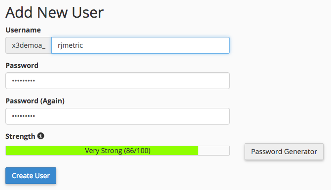

# 通过cPanel连接MySQL

* [创建 [!DNL MBI] cPanel中的MySQL用户](#cpanel)
* [在MBI中输入连接和用户信息](#finish)

## 跳到

* [通过SSH隧道的MySQL](../integrations/mysql-via-ssh-tunnel.md)
* [通过直接连接的MySQL](../integrations/mysql-via-a-direct-connection.md)

* **`MySQL via cPanel`**

>[!IMPORTANT]
>
>我们强烈建议您使用SSH或其他某种形式的加密来保护您的数据！ 如果不能，您仍然可以直接连接 [!DNL MBI] 使用本文中的说明将数据库添加到。

在本文中，我们将指导您直接将MySQL数据库连接到 [!DNL MBI] 使用cPanel”。 此过程还可用于连接 [!DNL Magento] 和任何其他基于MySQL的电子商务数据库 [!DNL MBI].

1. 创建 [!DNL MBI] 中的MySQL用户 `cPanel`
1. 在 [!DNL MBI]

开始使用。

## 创建 [!DNL MBI] 中的MySQL用户 `cPanel` {#cpanel}

1. 登录 [`cPanel`](../../../data-analyst/importing-data/integrations/mysql-via-cpanel.md) 通过您的托管提供商。
1. 单击 **[!UICONTROL MySQL Databases]**，位于 `Database` 中。
1. 向下滚动到 `Add New User` 部分，并为 [!DNL MBI]:

   

1. 单击 **[!UICONTROL Create User]**.
1. 现在，您已创建用户，接下来需要将其与数据库关联。 返回到 `Add New User` 部分 — 请参阅 `Add User to Database?` 这就是我们需要的。
1. 在 `User` 在此部分的下拉菜单中，选择您创建的用户。
1. 在 `Database` 在此部分的下拉列表中，选择要连接到的数据库 [!DNL MBI].
1. 单击 **[!UICONTROL Add]**.
1. 出现权限核对表时，请勾选 `SELECT`  — 这是全部 [!DNL MBI] 需要连接到数据库。

## 在中输入连接和用户信息 [!DNL MBI] {#finish}

总结一下，我们需要在 [!DNL MBI]. 是否使MySQL凭据页保持打开状态？ 如果没有，请转到 **[!UICONTROL Manage Data** > **Connections]** 单击 **[!UICONTROL Add New Data Source]**，然后显示MySQL图标。

在本页的 `Database Connection` 部分：

* `Username`:的用户名 [!DNL MBI] MySQL用户
* `Password`:的密码 [!DNL MBI] MySQL用户
* `Port`:您服务器上的MySQL端口(`3306` 默认)
* `Host`:的公共地址 `MySQL` 服务器 [!DNL MBI] 将连接到。 这通常是您用于登录的URL `cPanel`.

如果您使用 [`SSH tunnel`](../integrations/mysql-via-ssh-tunnel.md)，则还需要输入加密信息。 设置 `Encrypted` 切换至 `Yes` 以显示表单。

* `Connection Type`:将此参数设置为 `SSH Tunnel`
* `Remote Address`:服务器的IP地址或主机名 [!DNL MBI] 会穿隧
* `Username`:的用户名 [!DNL MBI] `SSH (Linux)` 用户，请参阅 [说明](../../../data-analyst/importing-data/integrations/mysql-via-ssh-tunnel.md) )
* `SSH Port`:服务器上的SSH端口(`22` 默认)

就这样！ 完成后，单击 **[!UICONTROL Save & Test]** 以完成设置。

## 相关：

* [重新验证集成](https://support.magento.com/hc/en-us/articles/360016733151)
