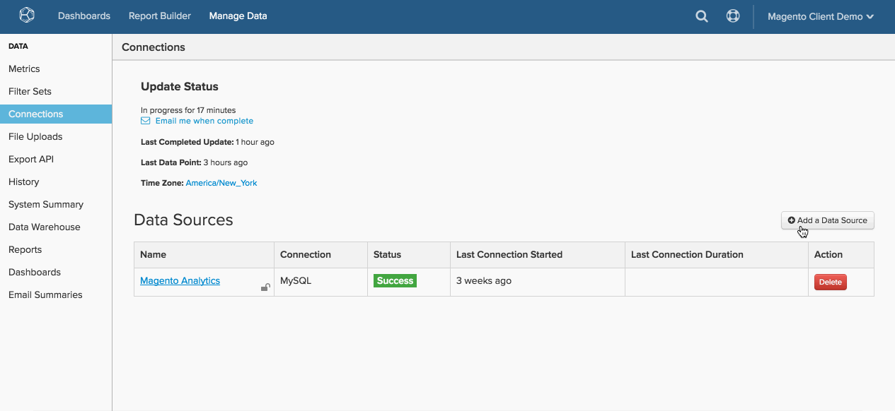

# 通过[!DNL SSH Tunnel]连接[!DNL MySQL]

* [检索 [!DNL Commerce Intelligence] 公钥](#retrieve)
* [允许访问 [!DNL Commerce Intelligence] IP地址](#allowlist)
* [为 [!DNL Commerce Intelligence]创建Linux用户](#linux)
* [为 [!DNL Commerce Intelligence]创建 [!DNL MySQL] 用户](#mysql)
* [在 [!DNL Commerce Intelligence]中输入连接和用户信息](#finish)

## 跳转到

* [[!DNL MySQL]通过 ](../integrations/mysql-via-a-direct-connection.md)
* [[!DNL MySQL]通过 [!DNL cPanel]](../integrations/mysql-via-cpanel.md)

要通过`SSH tunnel`将您的[!DNL MySQL]数据库连接到[!DNL Commerce Intelligence]，您必须执行以下操作：

1. 检索[!DNL Commerce Intelligence] `public key`
1. 允许访问[!DNL Commerce Intelligence] `IP address`
1. 为[!DNL Commerce Intelligence]创建一个`Linux`用户
1. 为[!DNL Commerce Intelligence]创建一个`MySQL`用户
1. 在[!DNL Commerce Intelligence]中输入连接和用户信息


## 正在检索[!DNL Commerce Intelligence]公钥 {#retrieve}

`public key`用于授权[!DNL Commerce Intelligence] `Linux`用户。 在下一部分中，您将创建用户并导入密钥。

1. 转到&#x200B;**[!UICONTROL Manage Data** > **Connections]**&#x200B;并单击&#x200B;**[!UICONTROL Add New Data Source]**。
1. 单击`MySQL`图标。
1. 打开`MySQL credentials`页面后，将`Encrypted`切换设置为`Yes`。 此时将显示SSH设置表单。
1. `public key`位于此表单下。

在整个教程中保持此页面处于打开状态 — 您将在下一部分和结尾处找到它。

以下是如何浏览[!DNL Commerce Intelligence]以检索密钥：

<!--{: width="770"}-->

## 允许访问[!DNL Commerce Intelligence] IP地址 {#allowlist}

要使连接成功，必须将防火墙配置为允许从IP地址访问。 它们是`54.88.76.97`和`34.250.211.151`，但它们也在`MySQL credentials`页面上。 请参阅上面GIF中的蓝色方框。

## 正在为[!DNL Commerce Intelligence]创建[!DNL Linux]用户 {#linux}

这可以是生产或辅助计算机，只要它包含实时（或经常更新）数据。 您可以按照您喜欢的方式[限制此用户](../../../administrator/account-management/restrict-db-access.md)，只要它保留连接到`MySQL`服务器的权利即可。

1. 要添加新用户，请以root用户身份在[!DNL Linux]服务器上运行以下命令：

```bash
        adduser rjmetric -p<password>
        mkdir /home/rjmetric
        mkdir /home/rjmetric/.ssh
```

1. 是否记得在第一节中检索到的`public key`？ 为确保用户有权访问数据库，您需要将密钥导入`authorized\_keys`。

   按如下方式将整个密钥复制到`authorized\_keys`文件中：

```bash
        touch /home/rjmetric/.ssh/authorized_keys
        "<PASTE KEY HERE>" >> /home/rjmetric/.ssh/authorized_keys
```

1. 要完成创建用户，请更改`/home/rjmetric`目录上的权限以允许通过`SSH`进行访问：

```bash
        chown -R rjmetric:rjmetric /home/rjmetric
        chmod -R 700 /home/rjmetric/.ssh
        chmod 400 /home/rjmetric/.ssh/authorized_keys
```

>[!IMPORTANT]
>
>如果与服务器关联的`sshd\_config`文件未设置为默认选项，则只有某些用户具有服务器访问权限 — 这会阻止成功连接到[!DNL Commerce Intelligence]。 在这些情况下，需要运行诸如`AllowUsers`之类的命令以允许`rjmetric`用户访问服务器。

## 正在为[!DNL Commerce Intelligence]创建[!DNL MySQL]用户 {#mysql}

您的组织可能需要不同的流程，但创建此用户的最简单方法是在以有权授予权限的用户身份登录[!DNL MySQL]时执行以下查询：

```sql
    GRANT SELECT ON *.* TO 'rjmetric'@'localhost' IDENTIFIED BY '<secure password here>';
```

使用安全密码替换`secure password here`，该密码可以不同于`SSH`密码。

要限制此用户访问特定数据库、表或列中的数据，您可以改为运行仅允许访问您允许的数据的GRANT查询。

## 在[!DNL Commerce Intelligence]中输入连接和用户信息 {#finish}

要完成工作，您需要在[!DNL Commerce Intelligence]中输入连接和用户信息。 您是否让`MySQL credentials`页面保持打开状态？ 如果没有，请转到&#x200B;**[!UICONTROL Data** > **Connections]**&#x200B;并单击&#x200B;**[!UICONTROL Add New Data Source]**，然后单击[!DNL MySQL]图标。 别忘了将`Encrypted`切换设置为`Yes`。

在此页面中输入以下信息，从`Database Connection`部分开始：

* `Username`： [!DNL Commerce Intelligence] [!DNL MySQL]用户的用户名
* `Password`： [!DNL Commerce Intelligence] [!DNL MySQL]用户的密码
* `Port`：您的服务器上的[!DNL MySQL]端口（默认为3306）
* `Host`默认情况下，这是本地主机。 通常，它是[!DNL MySQL]服务器的绑定地址值，默认情况下为`127.0.0.1 (localhost)`，但也可以是某些本地网络地址（例如，`192.168.0.1`）或服务器的公共IP地址。

  该值可以在`my.cnf`文件（位于`/etc/my.cnf`）中读取`\[mysqld\]`的行下找到。 如果bind-address行在该文件中被注释掉，则您的服务器将免受外部连接尝试的保护。

在`SSH Connection`部分中：

* `Remote Address`：服务器[!DNL Commerce Intelligence]的IP地址或主机名将隧道到
* `Username`： [!DNL Commerce Intelligence] SSH ([!DNL Linux])用户的用户名
* `SSH Port`：服务器上的SSH端口（默认为22）

完成后，单击&#x200B;**[!UICONTROL Save & Test]**&#x200B;以完成设置。

## 相关：

* [正在重新验证集成](https://experienceleague.adobe.com/docs/commerce-knowledge-base/kb/how-to/mbi-reauthenticating-integrations.html)
