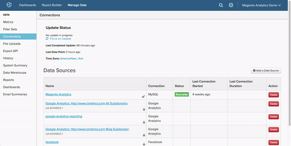

# 连接 `PostgreSQL` 通过 `SSH` 隧道

连接 `PostgreSQL` 数据库到 [!DNL MBI] 通过 `SSH tunnel`，则您（或您的团队，如果您不是技术人员）将需要执行以下操作：

1. [检索 [!DNL MBI] 公钥](#retrieve)
1. [允许访问 [!DNL MBI] IP地址](#allowlist)
1. [为创建Linux用户 [!DNL MBI] ](#linux)
1. [为创建Postgres用户 [!DNL MBI] ](#postgres)
1. [在MBI中输入连接和用户信息](#finish)

它不像听起来那么复杂。 开始使用。

## 检索 [!DNL MBI] `public key` {#retrieve}

的 `public key` 用于授权 [!DNL MBI] Linux用户。 在下一部分中，我们将创建用户并导入密钥。

1. 转到 **[!UICONTROL Manage Data** > **Connections]** 单击 **[!UICONTROL Add a Data Source]**.
1. 单击 `PostgreSQL` 图标。
1. 在 `PostgreSQL credentials` 页面打开，设置 `Encrypted` 切换至 `Yes`. 这将显示 `SSH` 设置窗体。
1. 的 `public key` 位于此表单下方。

在整个教程中，请保持此页面处于打开状态 — 您将在下一部分和最后需要该页面。

如果你有点迷路，这就是如何导航 [!DNL MBI] 要检索密钥，请执行以下操作：



## 允许访问 [!DNL MBI] IP地址 {#allowlist}

要使连接成功，您必须配置防火墙以允许从我们的IP地址访问。 it `54.88.76.97/32`，但也在 `PostgreSQL` 凭据页面。 看到上面GIF的蓝色方框？ 就这样！

## 创建 `Linux` 用户 [!DNL MBI] {#linux}

这可以是生产计算机或辅助计算机，但前提是它包含实时（或经常更新）数据。 您可以 [限制此用户](../../../administrator/account-management/restrict-db-access.md) 无论您喜欢哪种方式，只要它保留连接到PostgreSQL服务器的权利。

1. 要添加新用户，请在 `Linux` 服务器：

```bash
        adduser rjmetric -p<password>
        mkdir /home/rjmetric
        mkdir /home/rjmetric/.ssh
```

1. 记住 `public key` 我们在第一部分找到了？ 为确保用户有权访问数据库，我们需要将密钥导入 `authorized\_keys`.

   将整个密钥复制到 `authorized\_keys` 文件如下：

```bash
        touch /home/rjmetric/.ssh/authorized_keys
        "<PASTE KEY HERE>" >> /home/rjmetric/.ssh/authorized_keys
```

1. 要完成用户的创建，请更改 `/home/rjmetric` 允许通过访问的目录 `SSH`:

```bash
        chown -R rjmetric:rjmetric /home/rjmetric
        chmod -R 700 /home/rjmetric/.ssh
```

>[!IMPORTANT]
>
>如果 `sshd\_config` 与服务器关联的文件未设置为默认选项，只有某些用户具有服务器访问权限 — 这将阻止成功连接到 [!DNL MBI]. 在这些情况下，必须运行类似 `AllowUsers` 以允许rjmetric用户访问服务器。

## 创建 [!DNL MBI] Postgres用户 {#postgres}

贵组织可能需要不同的流程，但创建此用户的最简单方法是，以具有授予权限权限的用户身份登录Postgres后，执行以下查询。 用户还应拥有以下架构 [!DNL MBI] 正在获得访问权限。

```sql
    GRANT CONNECT ON DATABASE <database name> TO rjmetric WITH PASSWORD <secure password>;GRANT USAGE ON SCHEMA <schema name> TO rjmetric;GRANT SELECT ON ALL TABLES IN SCHEMA <schema name> TO rjmetric;ALTER DEFAULT PRIVILEGES IN SCHEMA <schema name> GRANT SELECT ON TABLES TO rjmetric;
```

替换 `secure password` 使用您自己的安全密码，该密码可能与SSH密码不同。 此外，请确保将 `database name` 和 `schema name` 的名称。

如果要连接多个数据库或模式，请根据需要重复此过程。

## 在中输入连接和用户信息 [!DNL MBI] {#finish}

总结一下，我们需要在 [!DNL MBI]. 是否使PostgreSQL凭据页保持打开状态？ 如果没有，请转到 **[!UICONTROL Manage Data > Connections]** 单击 **[!UICONTROL Add a Data Source]**，然后显示PostgreSQL图标。 不要忘记设置 `Encrypted` 切换至 `Yes`.

在此页中输入以下信息（从数据库连接部分开始）：

* `Username`:RJMetrics Postgres用户名（应为rjmetric）
* `Password`:RJMetrics Postgres密码
* `Port`:服务器上的PostgreSQL端口（默认为5432）
* `Host`: 127.0.0.1

在 `SSH Connection`:

* `Remote Address`:我们要SSH到的服务器的IP地址或主机名
* `Username`:我们的SSH登录名（应为rjmetric）
* `SSH Port`:服务器上的SSH端口（默认为22个）

就这样！ 完成后，单击 **保存并测试** 以完成设置。

### 相关

* [重新验证集成](https://experienceleague.adobe.com/docs/commerce-knowledge-base/kb/how-to/mbi-reauthenticating-integrations.html?lang=en)
