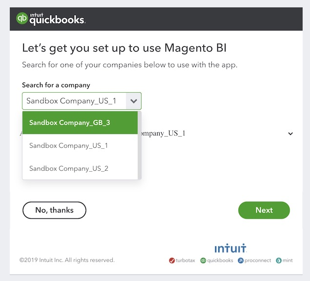

# 连接 [!DNL QuickBooks]

>[!NOTE]
>
>需要 [管理员权限](../../../administrator/user-management/user-management.md).

使用 [!DNL QuickBooks] 整合后，您的业务财务现在可以与您的销售和营销数据共存，从而让您能够快速、轻松地监控您的开支、识别过度支出等。

## 添加 [!DNL QuickBooks] 作为 [!DNL MBI]

1. 转到 `Integrations` 页面下 **[!UICONTROL Manage Data** > **Data Sources]**.
1. 单击 **[!UICONTROL Add Integration]**，位于屏幕右侧，位于 `Data Sources` 表。
1. 单击 `QuickBooks` 图标。
1. 单击 **[!UICONTROL Connect to Quickbooks]**.

## 授予 [!DNL MBI] 访问 [!DNL QuickBooks] 数据

单击 **[!UICONTROL Connect to Quickbooks]**，登录到 [!DNL Intuit] 帐户并授权连接：

1. 在 `Search for a company` 下拉列表，选择您的公司。
1. 单击 **[!UICONTROL Next]**. 系统会将您重定向到 [!DNL MBI] 和 *连接成功！* 消息将显示在屏幕顶部。

## 相关

* [预期 [!DNL QuickBooks] 数据](../integrations/quickbooks-data.md)
* [重新验证集成](https://support.magento.com/hc/en-us/articles/360016733151)
