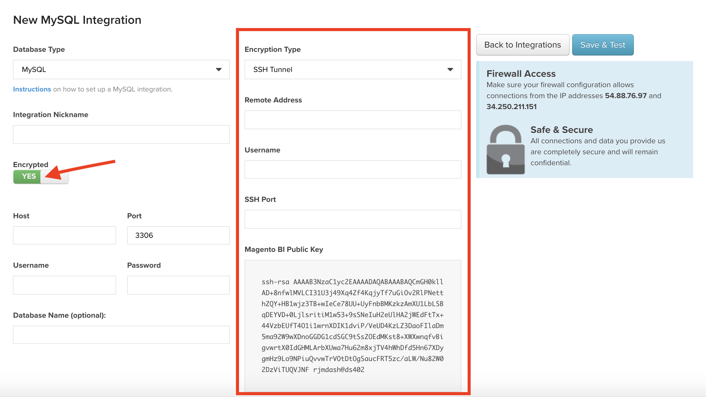

# 将图表添加到仪表板

可以使用位于屏幕右上角区域的[!UICONTROL Add Report]函数将现有图表添加到功能板中。 同一图表可以添加到多个功能板，这意味着如果编辑了此图表，则包含此图表的所有功能板都会反映这项更改。

>[!NOTE]
>
>单击&#x200B;**[!UICONTROL Add Report]**&#x200B;与单击图表编辑器中的&#x200B;**[!UICONTROL Save As]**&#x200B;不同。 `Add Report`仅将图表添加到仪表板，而`Save As`创建现有图表的版本。

## 添加图表

1. 单击&#x200B;**[!UICONTROL Add Report]**。 此时将显示现有图表的列表。

1. 搜索或单击要添加图表的名称。

1. 图表将添加到仪表板。

示例：

