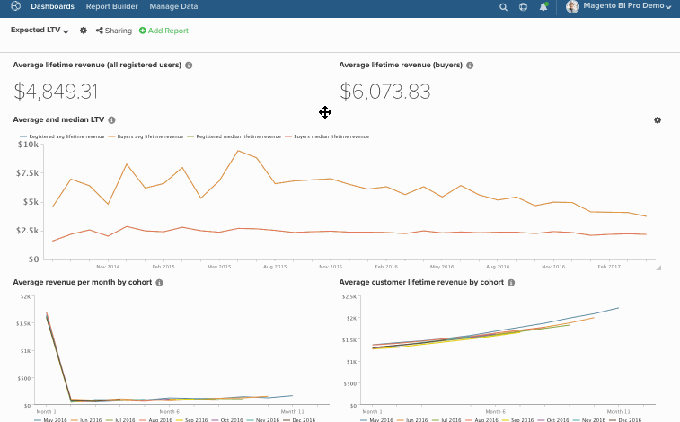
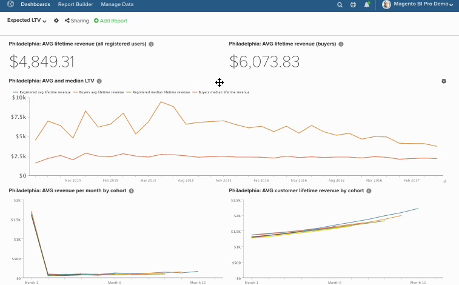

# 在功能板中批量编辑图表

通过批量编辑功能，可以轻松更改功能板中的图表名称和日期。 例如，您希望特定仪表板上的所有图表引用单个商店，并且每月而不是每季度进行报告。 让`bulk-editing`功能完成工作，而不是手动更改所有内容。 在本主题中，您将了解如何使用：

* [&#x200B; [!DNL Find/Replace] 功能](#findreplace)

* [&#x200B; [!DNL Prepend Name] 功能](#prepend)

* [&#x200B; [!DNL Change Dates] 功能](#dates)

话虽如此，请考虑此 — *这些更改是否需要永久性？*&#x200B;如果不能，请考虑克隆功能板，然后更改新功能板中的日期。 这允许您保留原始仪表板，同时仍可进行所需的更改。

>[!NOTE]
>
>如果要更改大量报告，则更新过程可能需要一点时间。

## 使用[!DNL Find/Replace] {#findreplace}

1. 单击仪表板名称旁边的齿轮（）图标，然后单击[!UICONTROL Bulk Edit Reports]窗口。

1. 在弹出窗口中单击&#x200B;**[!UICONTROL Chart Title Find and Replace]**。

1. 在`Chart Title Find`字段中，键入要查找的单词或字符。

1. 在`Replace With`字段中，键入应替换`Find`字段中内容的单词或字符。

1. 单击&#x200B;**[!UICONTROL Update Reports]**。

示例：

## 前置词`Chart Names` {#prepend}

1. 单击仪表板名称旁边的齿轮（）图标，然后单击[!UICONTROL Bulk Edit Reports]窗口。

1. 在弹出窗口中单击&#x200B;**[!UICONTROL Prepend Report Names]**。

1. 键入要在图表前添加的单词或字符。

1. 单击&#x200B;**[!UICONTROL Update Reports]**。

示例：

## 更改`Dates` {#dates}

1. 单击仪表板名称旁边的齿轮（）图标，然后选择[!UICONTROL Bulk Edit Reports]窗口。

1. 在弹出窗口中单击&#x200B;**[!UICONTROL Change Dates]**。

1. 设置新的`Start/End Date`和`Time Interval`。 您还可以保留这些字段不变。

1. 单击&#x200B;**[!UICONTROL Update Reports]**。

示例：

