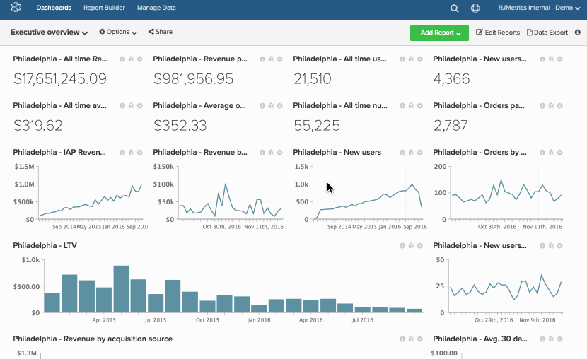

# 克隆功能板

通过克隆功能板，您可以将功能板中的所有报表复制到新的功能板中。

如果要重新创建一组现有的图表，但更改视角（例如，不同的数据视图、不同的市场、不同的网站或商店），此方法非常有用。 复制仪表板后，可以编辑每个新图表以更改其量度、数据视图、过滤器或分组依据。

1. 要克隆功能板，请单击屏幕顶部的&#x200B;**[!UICONTROL Options]**。

1. 在下拉菜单中，单击&#x200B;**[!UICONTROL Save As]**。

1. 出现提示时，输入`New Dashboard Name`。 Adobe会推荐一些名称，以便您一眼就知道仪表板中包含哪些信息。

   例如，您正在克隆名为`Customer Activity`的功能板。 该仪表板包含有关您费城位置的客户活动信息，但现在您要为位于纽约市的位置创建一个仪表板。 此仪表板可以命名为`New York City - Customer Activity`。

1. 使用`Chart Title Find`和`Chart Title Replace`字段查找标题中包含`Philadelphia`的所有图表并将其替换为`New York City`。

   如果您没有在这些字段中输入任何值，则会在新仪表板的所有图表标题末尾自动附加`(2)`。

1. 单击&#x200B;**[!UICONTROL Save]**&#x200B;以克隆功能板。

示例：

