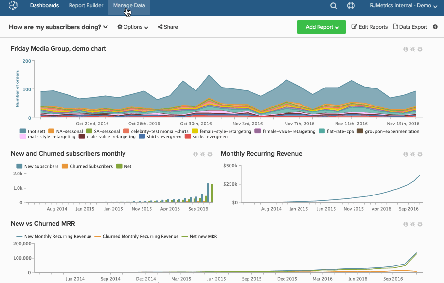

# 永久删除图表

即使您[从仪表板](../../data-user/dashboards/remove-charts-dashboard.md)中删除图表，它仍存在于您的[!DNL Commerce Intelligence]帐户中。

永久删除图表：

1. 单击侧栏中的&#x200B;**[!UICONTROL Account Setting]**。

1. 单击&#x200B;**[!UICONTROL Charts]**。

1. 您可以删除的图表（基于用户权限和图表所有权）将显示在屏幕的右侧。

1. 单击要删除的图表线旁边的复选框。

1. 单击&#x200B;**[!UICONTROL Delete Selected]**。

   >[!NOTE]
   >
   >如果该图表正在仪表板或电子邮件摘要中使用，则会显示通知。 若要继续，您必须确认删除，然后单击&#x200B;**[!UICONTROL Force Deletion]**。

示例：

<!--{: width="630" height="402"}-->
