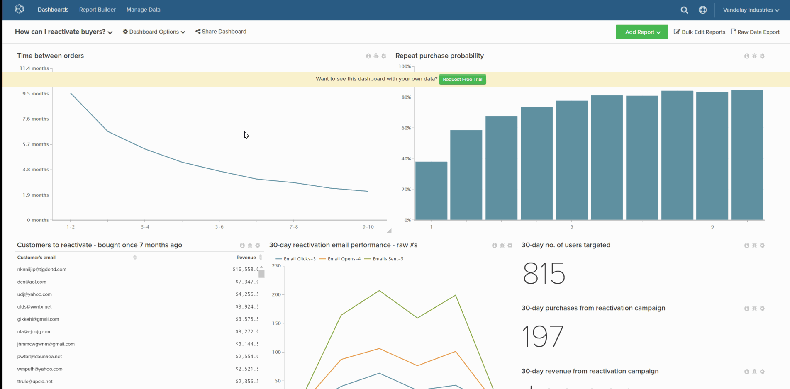
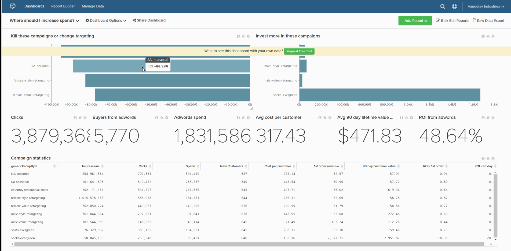

# 删除仪表板

如果您希望仪表板列表不要变得过于杂乱，可以删除不再需要的仪表板。 这可以通过两种方式之一实现：

1. [通过`Account Settings`页面](#account) — 此方法需要[管理员权限](../../administrator/user-management/user-management.md)。

1. [通过`Dashboard Options`菜单](#do) — 此方法要求您拥有仪表板或具有`Edit`权限。

## 通过`Account Settings`页面删除仪表板 {#account}

1. 单击&#x200B;**[!UICONTROL Account Settings** > **Dashboards]**。

1. 在功能板列表中，单击要删除的功能板。

1. 单击&#x200B;**[!UICONTROL Delete Dashboard]**。

示例：

<!--{: width="703" height="346"}-->

## 通过`Dashboard Options`菜单删除仪表板 {#do}

1. 单击屏幕顶部的&#x200B;**[!UICONTROL Dashboard Options]**&#x200B;菜单。

1. 在下拉列表中，单击&#x200B;**[!UICONTROL Delete]**。

1. 提示确认时，单击&#x200B;**[!UICONTROL Delete]**。

示例：

<!--{: width="703" height="347"}-->
