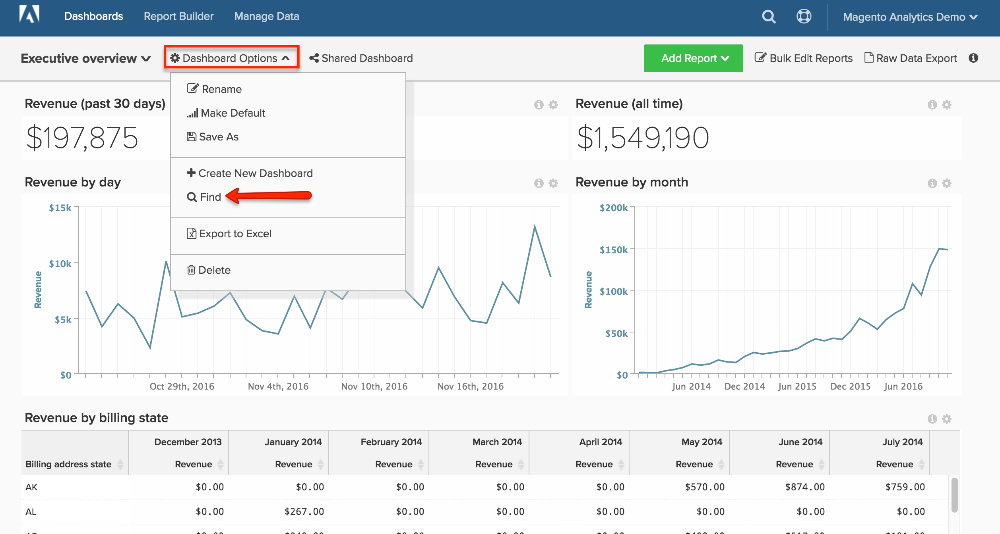

# 仪表板

[!DNL Adobe Commerce Intelligence]功能板让您快速了解商店的绩效和销售活动。 单个功能板可以与其他用户共享并组织到逻辑组中。 您还可以为其他用户设置不同级别的权限。

可以轻松创建报表、将其添加到功能板，以及将数据导出到Excel。 可以调整图表和报告的大小，并将其拖动到功能板上的适当位置。

## 创建仪表板 {#createdash}

功能板是可共享的、用于您在Report Builder中创建的分析的主题桶。 这就是您如何鼓励您的团队进行协作并在整个组织中维护单一真实来源的方法。

*如果您是管理员或标准用户*，则可以通过单击`Dashboard Options`下拉菜单并选择`Create New dashboard`来创建仪表板。

您所创建的功能板具体是什么样子完全由您决定。 您可以根据需要和工作流程在功能板中排列元素和调整元素大小。

### 创建功能板

1. 在菜单上，单击&#x200B;**[!UICONTROL Dashboards]**。

1. 默认仪表板的名称显示在仪表板标题的左上角。 单击向下箭头()显示可用选项。

   

1. 单击&#x200B;**[!UICONTROL Create Dashboard]**。 然后，执行以下操作：

   * 为您的仪表板输入`Name`。

   * 要为仪表板创建`Group`，请输入组的名称。

     例如，如果您的Commerce安装有多个商店视图，则可以为每个商店视图创建一个组。

   * 单击&#x200B;**[!UICONTROL Create]**。

   

   * 新仪表板的名称将显示在左上角。 单击向下箭头()显示选项。 如果创建了组，则新操控板将显示在列表中该组的下方。

### 添加报告

1. 要添加报告，请执行以下操作之一：

   * 单击页面上的&#x200B;**[!UICONTROL Add a report]**&#x200B;提示。

   * 在仪表板标题中，单击&#x200B;**[!UICONTROL Add Report]**。

     

1. 单击&#x200B;**[!UICONTROL Create Report]**&#x200B;以显示&#x200B;**[!UICONTROL Report Builder Options]**。

   

## 在仪表板上排列项目

* 要调整图表或报表的大小，请将右下角拖动到新大小。

* 要移动图表或报表，请将光标悬停在标题或标题上，直到光标变为十字形。 然后，将其拖动到位置。

## 管理您的仪表板 {#managedash}

在&#x200B;**[!DNL Manage Data** > **Dashboards]**&#x200B;中，您可以管理自己拥有的仪表板的用户权限、删除不再需要的仪表板，以及设置默认仪表板。

### 共享您的仪表板 {#sharingdash}

为了真正地在整个组织中扩展[!DNL Commerce Intelligence]并提供有价值的见解，Adobe鼓励您与其他团队成员共享您创建的功能板。 *您可以通过单击页面顶部的`Share Dashboard`选项共享您拥有的仪表板*。

当您共享功能板时，您可以跨整个组织或单独分配权限，这意味着您可以决定谁可以查看和编辑报表。

>[!NOTE]
>
>`Read-Only`用户只能访问与其直接共享的仪表板 — 他们自己无法搜索和添加仪表板。 别忘了把它们藏在圈子里！

### 访问共享功能板 {#accessshared}

*如果您是管理员或Standard用户*，并且想要向您的帐户添加共享仪表板，可以通过单击&#x200B;**[!UICONTROL Dashboard Options]**，然后单击下拉菜单中的&#x200B;**[!UICONTROL Find]**&#x200B;来执行此操作。

<!--{: width="1000" height="535"}-->

### 管理功能板设置

1. 在菜单上，单击&#x200B;**[!DNL Manage Data** > **Dashboards]**。

1. 如果适用，请输入新的`Dashboard Name`。

1. 要将仪表板分配给特定`Dashboard Group`，请从组列表中选择。

   **`Permissions`**

   要向所有用户授予对功能板的相同级别的访问权限，请执行以下操作：

   1. 在&#x200B;**`Shared with`**&#x200B;下，选择以下选项之一：

      * `View`
      * `Edit`
      * `None`

   1. 提示确认时，单击&#x200B;**[!UICONTROL OK]**&#x200B;以更新每个用户的权限级别。

   1. 要更改个人的权限级别，请在列表中查找用户以更改权限级别。 更改将自动保存。

   **`Default`**

   1. 若要将此仪表板设为您[!DNL Commerce Intelligence]帐户的默认值，请单击&#x200B;**[!UICONTROL Make Default]**。

   **`Remove`**

   1. 要删除仪表板，请单击&#x200B;**[!UICONTROL Delete Dashboard]**。
