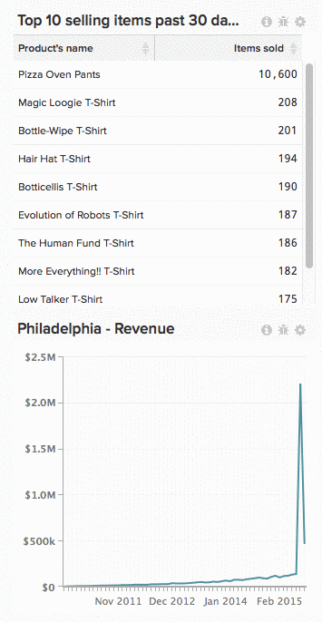

# 从功能板中删除图表

要从功能板中删除图表，请单击)图标，然后单击 **[!UICONTROL Remove from Dashboard]**.

>[!NOTE]
>
>删除图表与 [删除](../../data-user/dashboards/delete-chart.md). 此外， [图表可以重新添加到功能板](../../data-user/dashboards/add-charts-dashboard.md) 随时。

