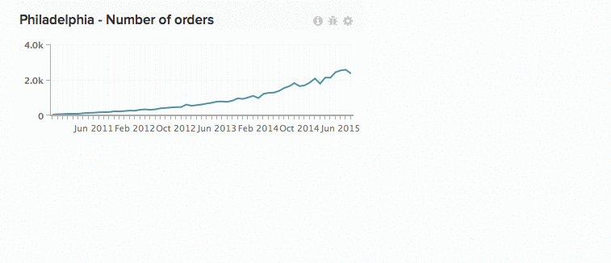
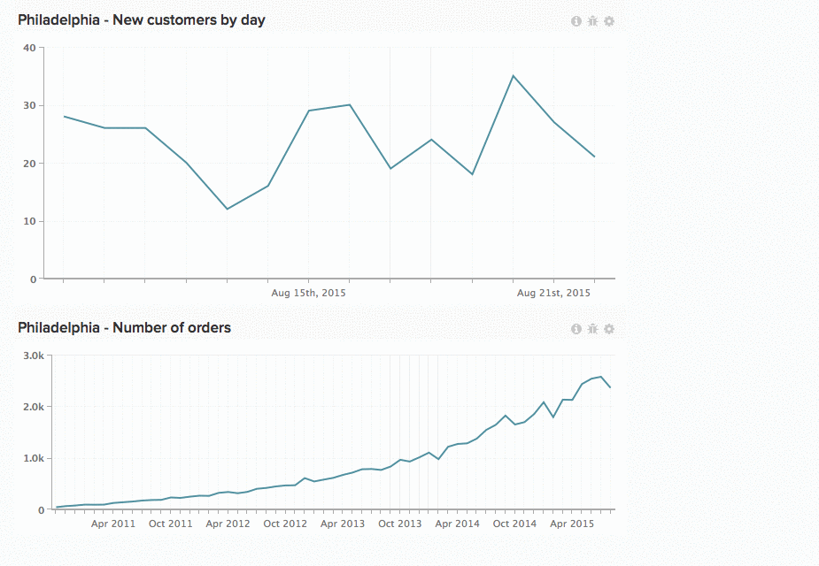

# 在功能板中使用图表

标量数字。 条形图。 长期扩展的图表。 每个图表显示信息的方式各不相同，这意味着图表的大小和位置并非一刀切的解决方案。 In [!DNL Commerce Intelligence]，您可以调整图表大小并重新排列图表，以创建理想的工作区。

*调整图表大小*，单击并拖动任何图表的右下角。

*移动图表*，将鼠标悬停在图表顶部，直到 `Move` 光标显示。 单击并按住，然后将图表拖动到所需的位置。 释放单击以放置图表。

