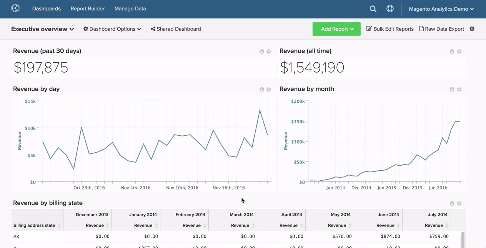
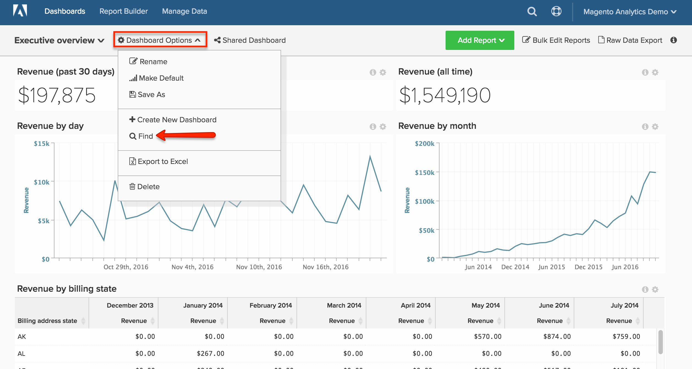

# 搜索功能板

本主题将向您展示如何使用[[!DNL Global Search] 功能](#global)来查找功能板，以及如何搜索其他用户拥有的[功能板](#other)。

## 全局搜索 {#global}

[!DNL Global Search]菜单允许您搜索和选择要查看的仪表板。

* *要查看现有功能板的列表*，请单击该功能板。

* *要搜索仪表板*，请在单击仪表板的下拉列表后，在搜索栏中输入一些搜索条件。 如果有任何功能板符合条件，它们会首先在列表中显示。

示例：

## 查找其他用户拥有的仪表板 {#other}

正在查找其他用户拥有的仪表板？ 如果其他人可以查看仪表板，则您可以通过单击`Dashboard Options`下拉列表中的&#x200B;**[!UICONTROL Find]**&#x200B;来搜索该仪表板。

