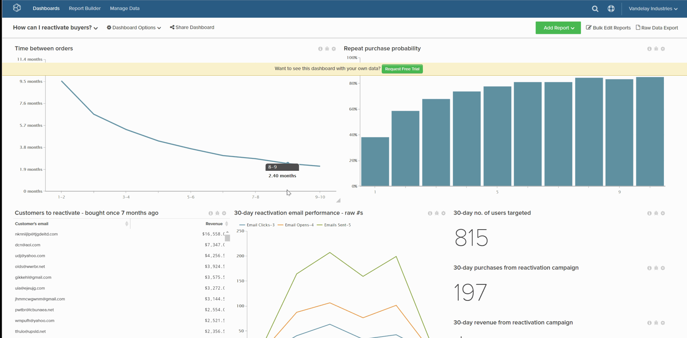

# 设置默认仪表板

默认仪表板是您在打开[!DNL Commerce Intelligence]时看到的第一个仪表板。

1. 在仪表板中，单击位于屏幕顶部的&#x200B;**[!UICONTROL Dashboard Options]**。

1. 在下拉菜单中单击&#x200B;**[!UICONTROL Make Default]**。

1. 显示确认提示时，单击&#x200B;**[!UICONTROL Yes]**&#x200B;更改默认仪表板。

现在这是您的新默认信息板。

示例：

