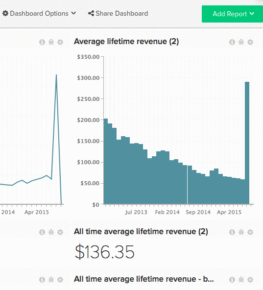

# 与其他用户共享功能板

共享功能板是让您的团队保持循环状态并鼓励协作讨论的绝佳方式。 通过创建和共享中央仪表板，您可以在保持控制的同时为团队提供所需的信息。 [我们建议](../../best-practices/share-dashboard-best-practice.md){:target=&quot;_blank&quot;} `Edit` 对少数受众的权限，以最大限度地减少意外更改。

>[!NOTE]
>
>如果您共享的功能板包含使用特定用户无权访问的量度构建的报表，则这些报表会显示 `Error Loading Data` 消息。 如果您希望向特定用户显示数据，则 [管理员用户](../../administrator/user-management/user-management.md) 必须授予对这些报表中使用的所有量度的访问权限。

## 共享功能板

1. 单击 **[!UICONTROL Share Dashboard]** 来访问Advertising Cloud的帮助。

   您的 [!DNL MBI] 帐户。

1. 要选择要与之共享功能板的用户，请勾选其名称左侧的方框。

   要选择/取消选择所有用户，请单击 **[!UICONTROL Select]** 选择 `Everyone` 或 `None`，分别为。

1. 权限可以按用户进行设置，也可以批量设置。

   *设置单个权限*，单击 **[!UICONTROL None]** 的位置。 从此下拉菜单中，选择用户应具有的权限类型。

   *集体设置权限*，单击 **[!UICONTROL Set Permissions]**. 从此下拉菜单中，选择选定用户应具有的权限类型。

   >[!NOTE]
   >
   >您还可以使用此功能更新以前设置的权限。 例如，如果您要停止与某人共享功能板，请将其权限设置为 `None`.

1. 要共享功能板，请单击 **[!UICONTROL Save Changes]**. 选定的用户将收到一封电子邮件，邀请他们查看功能板。

示例：

