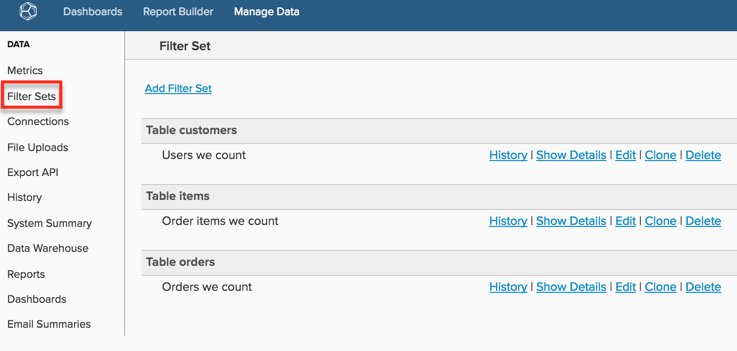

# 创建过滤器集

如果[!DNL Commerce Intelligence]中有多个量度需要以类似方式过滤（例如，过滤掉测试订单），您可以创建保存的过滤器集并将它们应用于量度。 这样可节省您的时间，因为在创建或编辑量度时您不必添加单个过滤器。

有关详细信息，请参阅[培训视频](https://experienceleague.adobe.com/docs/commerce-knowledge-base/kb/how-to/mbi-training-video-filter-sets.html?lang=zh-Hans)。

>[!NOTE]
>
>需要[管理员权限](../../administrator/user-management/user-management.md)。

1. 单击侧栏中的&#x200B;**[!DNL Manage Data** > **Filter Sets]**。

   

1. 单击页面顶部的&#x200B;**[!UICONTROL Add Filter Set]**。

1. 选择包含要过滤的量度的表。

   例如，如果要筛选`Total number of orders`量度并且它构建在`orders`表中，请选择该表。

1. 为`Filter Set`命名。

1. 添加所有相关筛选器。

   例如，如果您只想在`Total number of orders`指标中包含状态为完成的订单，则应用过滤器以排除所有状态不是`complete`的订单。

1. 验证筛选器逻辑以及括号和运算符的放置是否正确：例如，`\[A\] AND \[B\]; (\[A\] OR \[B\]) AND \[C\]`。

   不正确的筛选器通常是[!DNL Commerce Intelligence]报表与预期结果之间数据不一致的原因。

1. 保存`Filter Set`。

保存过滤器集后，您可以将其应用于使用同一表的任何量度。 例如，如果您在`Filter Set`表中创建了`orders`，则可以将其应用于在此表中构建的&#x200B;*任何量度*，如`Revenue`。

>[!NOTE]
>
>`Filter Sets`还可以应用于[!DNL Commerce Intelligence]中的计算列。 您可以通过联系支持人员，请求将筛选器集应用到[!DNL Commerce Intelligence]中创建的数据维度。

## 相关

* [分段和过滤的最佳实践](../../best-practices/segment-filter.md)
