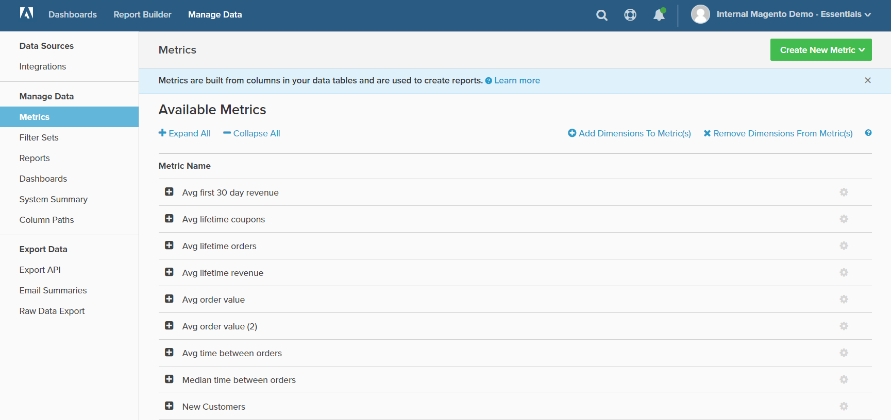

# 管理数据

通过“管理数据”，您可以访问各种工具来管理集成、报表和图表数据、功能板和导出。

## 访问 `Manage Data`:

1. 在菜单中，单击 **[!DNL Manage Data]**.

1. 在侧栏中，在以下标题下选择您想要的主题：

   * `Data Sources`
   * `Manage Data`
   * `Export Data`
   <!--{: .zoom}-->
