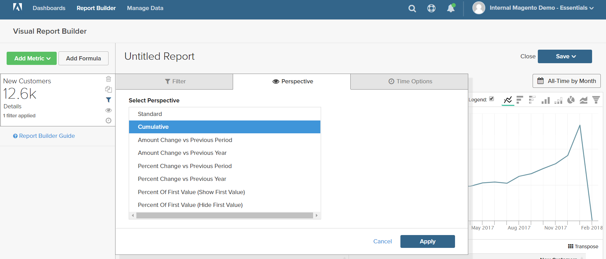

# 过滤器

可添加一个或多个筛选器以限制用于生成报表的数据。 每个过滤器都是一个表达式，其中包含关联表中的列、运算符和值。 例如，要仅包含回头客户，您可以创建一个仅包含已下多张订单的客户的过滤器。 多个过滤器可以与逻辑过滤器一起使用 `AND/OR` 运算符，向报表添加逻辑。

>[!TIP]
>
>报表最多可以包含3,500个数据点。 要减少数据点的数量，请使用过滤器减少用于生成报表的数据量。

[!DNL Adobe Commerce Intelligence] 包括一系列过滤器，您可以使用这些过滤器“开箱即用(OOTB)”，也可以根据您的需求对其进行修改。 您可以创建的过滤器数量没有限制。

## 要添加过滤器，请执行以下操作：

1. 在图表中，将鼠标悬停在每个数据点上。

   在此报表中，每个数据点显示当月客户总数。

1. 在左侧面板中，单击过滤器()图标。

   

1. 单击 **[!UICONTROL Add Filter]**.

   过滤器按字母顺序编号，第一个过滤器为 `[A]`. 过滤器的前两个部分是下拉列表选项，第三个部分是值。

   

   * 单击过滤器的第一部分，然后选择要用作表达式主体的列。

     

   * 单击过滤器的第二部分，然后选择运算符。

     

   * 在筛选器的第三部分中，输入完成表达式所需的值。

     

   * 筛选完成后，单击 **[!UICONTROL Apply]**.

     现在，该报表仅包含回头客户，为该报表检索的客户记录数已从33,000减至12,600。

     <!--{: .zoom}-->

1. 在侧边栏中，单击透视( )图标。

   <!--{: .zoom}-->

1. 在设置列表中选择 `Cumulative`. 然后，单击 **[!UICONTROL Apply]**.

   

   此 `Cumulative` 透视图会随时间分布变化，而不是显示每个月的锯齿状上下变化。

1. 输入 `Title` ，然后单击 **[!UICONTROL Save]** 它作为 `Chart` 到您的信息板。

   
