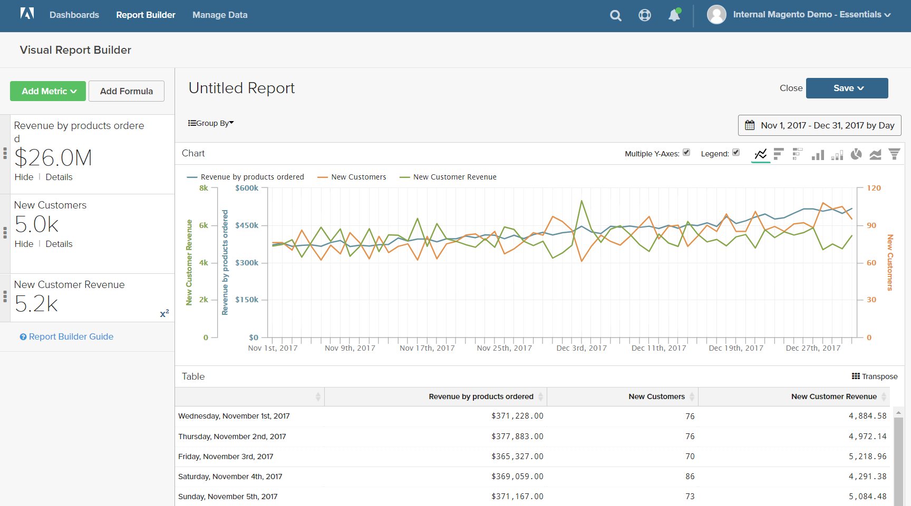

# 公式

公式将多个量度和数学逻辑结合在一起来回答问题。 例如，假日季节期间每个产品的收入中有多少是由新客户产生的？

## 步骤1:创建基本报表

1. 在菜单中，选择 `Report Builder`.

1. 单击 **[!UICONTROL Add Metric]** 并为报表选择第一个量度。

   在本例中， `Revenue by products ordered` 量度。

1. 单击 **[!UICONTROL Add Metric]** 再次选择报表的第二个量度。

   在本例中， `New Customers` 量度。

1. 在侧栏中，单击 **[!UICONTROL Details]** 以显示有关每个量度的信息。

   

1. 在侧栏中，单击每个量度的名称，以在新的浏览器选项卡中打开设置页面。 向下滚动以查看量度的每个组件，包括量度查询、过滤器和维度。

   

1. 要返回报表，请单击上一个浏览器选项卡。

1. 在图表中，将鼠标悬停在每行上的几个数据点上，可查看与每个量度关联的金额。

## 步骤2:添加公式

1. 在侧栏的顶部，单击 **[!UICONTROL Add Formula]**.

   公式框将量度显示为可用输入 `A` 和 `B`，并包含一个可在其中输入公式的输入框。

   执行以下操作：

   * 在 `Enter your Formul` 输入框，输入 `A/B`.

      这会将收入除以产品订购数除以新客户数。

   * 已设置 `Select format` to `123Number`.

   * 在侧栏中，替换 `Untitled` 的名称。

   

1. 完成后，单击 **[!UICONTROL Apply]**.

   报表现在有一行公式， `New Customer Revenue`，侧栏会显示新客户产生的收入总额。

   

## 步骤3:添加日期范围

1. 单击 **[!UICONTROL Date Range]** 中。

1. 在 `Fixed Date Range` 选项卡，请执行以下操作：

   * 在日历上，选择日期范围。

      对于此示例，假日季节从11月1日到12月31日。

   * 在 `Select Time Interval`，选择 `Day`.

      

   * 完成后，单击 **[!UICONTROL Apply]**.

   报表现在仅限于假日季节，每天都有一个数据点。

   

## 步骤4:保存报表

在此步骤中，您会将报表另存为图表和表格。

1. 单击 `Untitled Report` ，然后输入描述性标题。 在本例中，报表标题为 `2017 Holiday Sales`.

   然后，执行以下操作：

   * 在右上角，单击 **[!UICONTROL Save]**.

   * 对于 `Type`，接受默认值 `Chart` 设置。

   * 选择 `Dashboard` 报告的可用位置。

   * 单击 **[!UICONTROL Save to Dashboard]**.

1. 单击报表标题并更改名称。 在本例中，报表标题将更改为 `2017 Holiday Sales Data`.

   然后，执行以下操作：

   * 在右上角，单击 **[!UICONTROL Save a Copy]**.

   * 已设置 `Type` to `Table`.

   * 选择 `Dashboard` 报告的可用位置。

   * 单击 **[!UICONTROL Save a Copy to Dashboard]**.

1. 要在功能板中查看报表，请执行以下操作之一：

   * 单击 **[!UICONTROL Go to Dashboard]** ，以查看位于页面顶部的消息。

   * 在菜单中，选择 **[!UICONTROL Dashboards]**. 单击当前功能板的名称以显示列表。 然后，单击保存报表的功能板名称。
