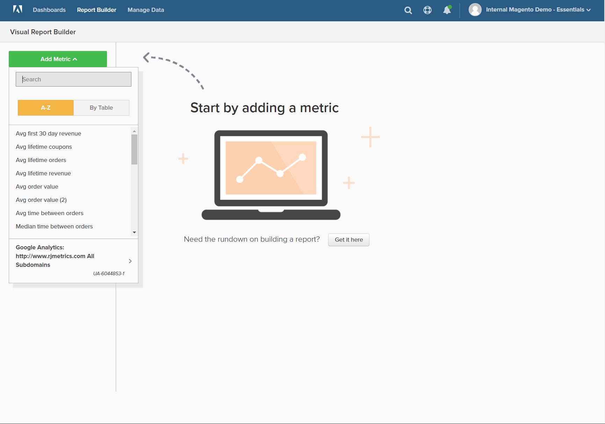
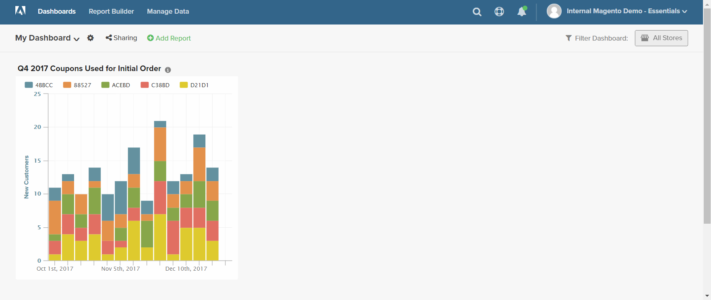

# `Visual Report Builder`

`Visual Report Builder` 使基于预定义量度创建快速报表变得轻松。 每个量度都包含一个查询，该查询定义报表的数据集。

以下示例说明如何创建简单报表、按附加维度分组数据、设置日期和时间间隔、更改图表类型以及将报表保存到功能板。

## 要创建简单报表，请执行以下操作：

1. 在 [!DNL MBI] 菜单，单击 **[!UICONTROL Report Builder]**.

1. 下 `Visual Report Builder`，单击 **[!UICONTROL Create Report]** 并执行以下操作：

   * 单击 **[!UICONTROL Add Metric]**.

      可用的量度可以按字母顺序或表格列出。

      

   * 选择 [量度](../../data-user/reports/ess-manage-data-metrics.md) 描述要用于报表的数据集。

      此 `New Customers` 此示例中使用的指标计算所有客户，并按客户注册帐户的日期对列表进行排序。 初始报告包含一个简单的线形图，后面是数据表。

      左侧的摘要显示当前指标的名称，其后是指标中指定的对列数据的任何计算的结果。 在此示例中，汇总显示客户总数。

      

1. 在图表中，将鼠标悬停在线条上的每个数据点上。 每个数据点显示该月注册的新客户的总数。

1. 按照以下说明对数据分组、更改日期范围和图表类型。

   **`Group By`**

   此 `Group By` 通过控制，可按组或区段添加多个维度。 Dimension是表中可用于对数据进行分组的列。

   * 从的列表中选择一个可用维度 `Group By` 选项。

      对于此示例，系统在客户首次下订单时发现了五个优惠券代码。

      

      此 `Group By` 详细信息列出了客户使用的每个优惠券。 用于下达初始订单的优惠券带有复选框。 现在，图表中有多条彩色线条，表示用于第一笔订单的每个优惠券。 图例采用颜色编码以对应于每一行数据。

   * 单击 **[!UICONTROL Apply]** 以关闭“分组依据”详细信息。

      

   * 将鼠标悬停在每行上的几个数据点上，可查看当月首次订购该优惠券时使用该优惠券的客户数量。

   * 数据表现在有一个附加维度，其中每月有一列，每个优惠券代码有一行。

      

   * 单击转置()控件以更改数据的方向。

      数据轴翻转，此时表格中为每张优惠券代码各有一列，每月有一行。 您可能会发现此方向更易于阅读。

      
   **`Date Range`**

   此 `Date Range` 控件显示当前日期范围和时间间隔设置，并且位于图表正上方的右侧。

   * 单击 `Date Range` 控件，在本例中，该控件设置为 `All-Time by Month`.

      

   * 进行以下更改：

      * 要放大以放大视图，请将日期范围更改为 `Last Full Quarter`.
      * 下 `Select Time Interval`，选择 `Week`.
      * 完成后，单击 **[!UICONTROL Save]**.

      现在，报表仅包含按周显示的最后一个季度的数据。

      
   **图表类型**

   * 单击右上角的控件以查找最适合该数据图表。

      某些图表类型与多维数据不兼容。

      |  |  |
      |-----|-----|
      |  | 折线图 |
      |  | 水平条形图 |
      |  | 水平栈叠条形图 |
      |  | 垂直条 |
      |  | 垂直栈叠条形图 |
      |  | 饼图 |
      |  | 面积图 |
      |  | 漏斗 |

      {style="table-layout:auto"}

1. 为报表赋值 `title`，替换 `Untitled Report` 具有描述性标题的页面顶部文本。

1. 在右上角，单击 **[!UICONTROL Save]** 并执行以下操作：

   * 对象 `Type`，接受默认设置， `Chart`.

   * 选择 `Dashboard` 在报表可用的位置。

   * 单击 **[!UICONTROL Save to Dashboard]**.

      

1. 要在仪表板中查看图表，请执行下列操作之一：

   * 单击 **[!UICONTROL Go to Dashboard]** 页面顶部的消息中。

   * 在菜单中，选择 `Dashboards` ，然后单击当前仪表板的名称以显示列表。 然后，单击保存报告的功能板名称。

      
