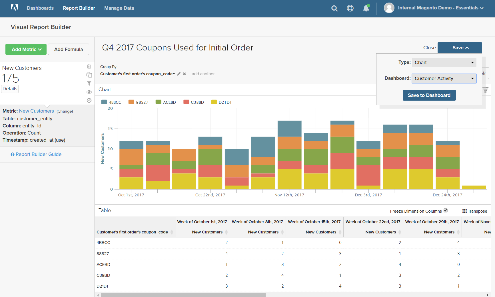

# `Visual Report Builder`

`Visual Report Builder` 使基于预定义量度创建快速报表更为简单。 每个量度都包含一个查询，用于定义报表的数据集。

以下示例显示如何创建简单报表、按附加维度对数据进行分组、设置日期和时间间隔、更改图表类型以及将报表保存到功能板。

## 要创建简单的报表，请执行以下操作：

1. 在 [!DNL MBI] 菜单，单击 **[!UICONTROL Report Builder]**.

1. 在 `Visual Report Builder`，单击 **[!UICONTROL Create Report]** 并执行以下操作：

   * 单击 **[!UICONTROL Add Metric]**.

      可用量度可按字母顺序或按表列出。

      

   * 选择 [量度](../../data-user/reports/ess-manage-data-metrics.md) 描述要用于报表的数据集。

      的 `New Customers` 此示例中使用的量度会计算所有客户，并按客户注册帐户的日期对列表进行排序。 初始报表包含一个简单的折线图，后跟数据表。

      左侧的摘要显示当前量度的名称，后跟量度中指定的列数据的任何计算结果。 在此示例中，概要显示客户总计数。

      

1. 在图表中，将鼠标悬停在折线上的每个数据点上。 每个数据点都显示当月注册的新客户总数。

1. 按照这些说明对数据进行分组、更改日期范围和图表类型。

   **`Group By`**

   的 `Group By` 通过控件，您可以按组或区段添加多个维度。 Dimension是表中可用于对数据进行分组的列。

   * 从 `Group By` 选项。

      在此示例中，系统找到了客户在下订单时使用的五个优惠券代码。

      

      的 `Group By` 详细信息列出了客户使用的每个优惠券。 用于下达初始订单的优惠券会用复选框进行标记。 图表现在有多条彩色线条，这些线条表示用于首次订购的每个优惠券。 图例采用颜色编码，以对应每一行数据。

   * 单击 **[!UICONTROL Apply]** 以关闭“组依据”详细信息。

      

   * 将鼠标悬停在每行上的几个数据点上，可查看当月在下订单时使用该优惠券的客户数量。

   * 数据表现在有一个添加维度，每月包含一列，每个优惠券代码都有一个对应的行。

      

   * 单击转置()控件来更改数据的方向。

      数据的轴将翻转，表格现在包含每个优惠券代码的列和每个月的行。 您可能会发现此方向更易于阅读。

      
   **`Date Range`**

   的 `Date Range` 控件显示当前日期范围和时间间隔设置，位于右侧图表的正上方。

   * 单击 `Date Range` 控制，在本例中，该控制设置为 `All-Time by Month`.

      

   * 进行以下更改：

      * 要放大更近的视图，请将日期范围更改为 `Last Full Quarter`.
      * 在 `Select Time Interval`，选择 `Week`.
      * 完成后，单击 **[!UICONTROL Save]**.

      报表现在仅包含上一季度的数据（按周）。

      
   **图表类型**

   * 单击右上角的控件以查找数据的最佳图表。

      某些图表类型与多维数据不兼容。

      |  |  |
      |-----|-----|
      |  | 折线图 |
      |  | 水平条 |
      |  | 水平堆叠条形图 |
      |  | 垂直条 |
      |  | 垂直堆叠条形图 |
      |  | 派 |
      |  | 面积图 |
      |  | 漏斗 |

      {style=&quot;table-layout:auto&quot;}

1. 为报表提供 `title`，替换 `Untitled Report` 文本，其中包含描述性标题。

1. 在右上角，单击 **[!UICONTROL Save]** 并执行以下操作：

   * 对于 `Type`，接受默认设置， `Chart`.

   * 选择 `Dashboard` 报告的可用位置。

   * 单击 **[!UICONTROL Save to Dashboard]**.

      

1. 要在功能板中查看图表，请执行以下操作之一：

   * 单击 **[!UICONTROL Go to Dashboard]** ，以查看位于页面顶部的消息。

   * 在菜单中，选择 `Dashboards` 并单击当前功能板的名称以显示列表。 然后，单击保存报表的功能板名称。

      
