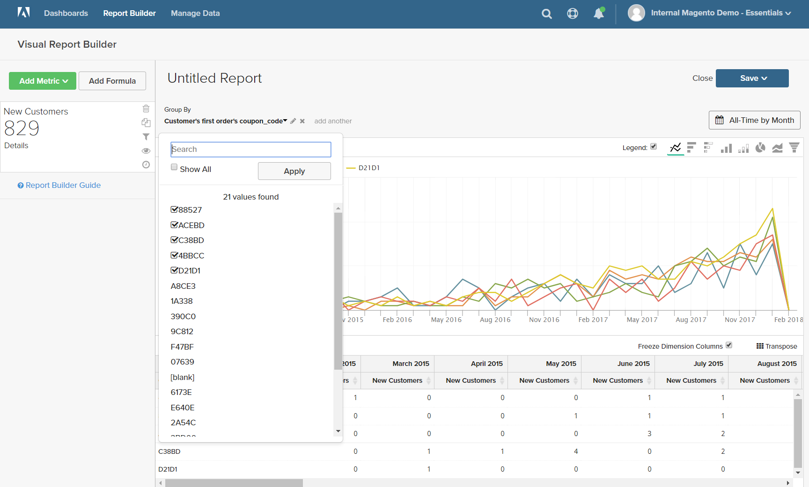
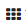

# [!DNL Visual Report Builder]

通过[!DNL Visual Report Builder]，可轻松根据预定义量度创建快速报表。 每个量度都包含一个查询，该查询定义报表的数据集。

以下示例说明如何创建简单报表、按附加维度对数据分组、设置日期和时间间隔、更改图表类型以及将报表保存到仪表板。

## 要创建简单报表，请执行以下操作：

1. 在[!DNL Commerce Intelligence]菜单中，单击&#x200B;**[!UICONTROL Report Builder]**。

1. 在[!UICONTROL Visual Report Builder]下，单击&#x200B;**[!UICONTROL Create Report]**&#x200B;并执行以下操作：

   * 单击&#x200B;**[!UICONTROL Add Metric]**。

     可用的量度可以按字母顺序或表格列出。

     

   * 选择描述要用于报表的数据集的[指标](../../data-user/reports/ess-manage-data-metrics.md)。

     此示例中使用的`New Customers`量度计算所有客户，并按客户注册帐户的日期对列表进行排序。 初始报告包含一个简单的线形图，后面是数据表。

     左侧的摘要显示当前指标的名称，其后是指标中指定的任何列数据的计算结果。 在本例中，汇总显示客户总数。

     

1. 在图表中，将鼠标悬停在线条上的每个数据点上。 每个数据点显示该月注册的新客户的总数。

1. 按照以下说明对数据分组、更改日期范围和图表类型。

   **`Group By`**

   `Group By`控件允许您按组或区段添加多个维度。 维度是表中可用于分组数据的列。

   * 从`Group By`选项列表中选择一个可用维度。

     在本例中，系统发现客户在首次订购时使用了五个优惠券代码。

     

     `Group By`详细信息列出了客户使用的每个优惠券。 用于下达初始订单的优惠券带有复选框。 图表现在有多条彩色线条，表示用于第一订单的每个优惠券。 图例采用颜色编码以对应于每一行数据。

   * 单击&#x200B;**[!UICONTROL Apply]**&#x200B;以关闭“分组依据”详细信息。

     

   * 将鼠标悬停在每行上的几个数据点上，可查看当月首次订购该优惠券时使用该优惠券的客户数量。

   * 数据表现在具有附加维度，其中每月有一列，每个优惠券代码有一行。

     

   * 单击表右上角的转置()控件以更改数据的方向。

     数据轴翻转，现在表格中每个优惠券代码对应一列，每个月对应一行。 您可能会发现此方向更易于阅读。

     

   **`Date Range`**

   `Date Range`控件显示当前日期范围和时间间隔设置，并且位于图表正上方的右侧。

   * 单击`Date Range`控件，在此示例中该控件设置为`All-Time by Month`。

     

   * 进行以下更改：

      * 若要放大查看，请将日期范围更改为`Last Full Quarter`。
      * 在`Select Time Interval`下，选择`Week`。
      * 完成后，单击&#x200B;**[!UICONTROL Save]**。

     现在，该报表仅包含上一季度（按周）的数据。

     报告上一季度

   **图表类型**

   * 单击右上角的控件可找到最适合该数据对应的图表。

     某些图表类型与多维数据不兼容。

     | | |
     |-----|-----|
     |  | 折线图 |
     |  | 水平条形图 |
     |  | 水平栈叠条形图 |
     |  | 垂直条 |
     |  | 垂直栈叠条形图 |
     |  | 饼图 |
     |  | 面积 |
     |  | 漏斗 |

     {style="table-layout:auto"}

1. 要为报表提供`title`，请将页面顶部的`Untitled Report`文本替换为描述性标题。

1. 单击右上角的&#x200B;**[!UICONTROL Save]**&#x200B;并执行以下操作：

   * 对于`Type`，接受默认设置`Chart`。

   * 选择要提供报表的`Dashboard`。

   * 单击&#x200B;**[!UICONTROL Save to Dashboard]**。

     

1. 要在仪表板中查看图表，请执行下列操作之一：

   * 单击页面顶部消息中的&#x200B;**[!UICONTROL Go to Dashboard]**。

   * 在菜单中，选择`Dashboards`并单击当前仪表板的名称以显示列表。 然后，单击保存报告的仪表板的名称。

     
