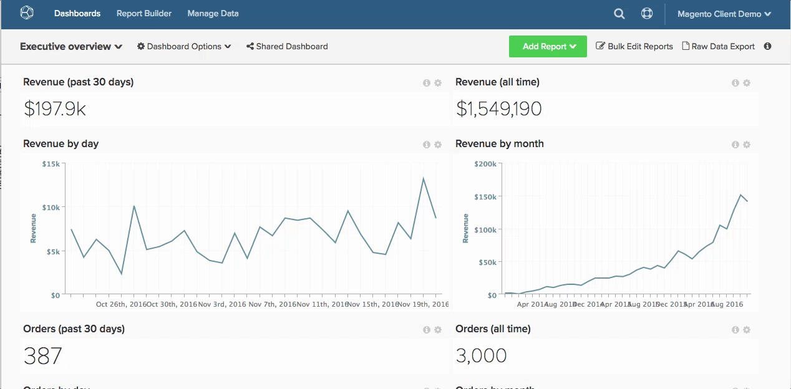
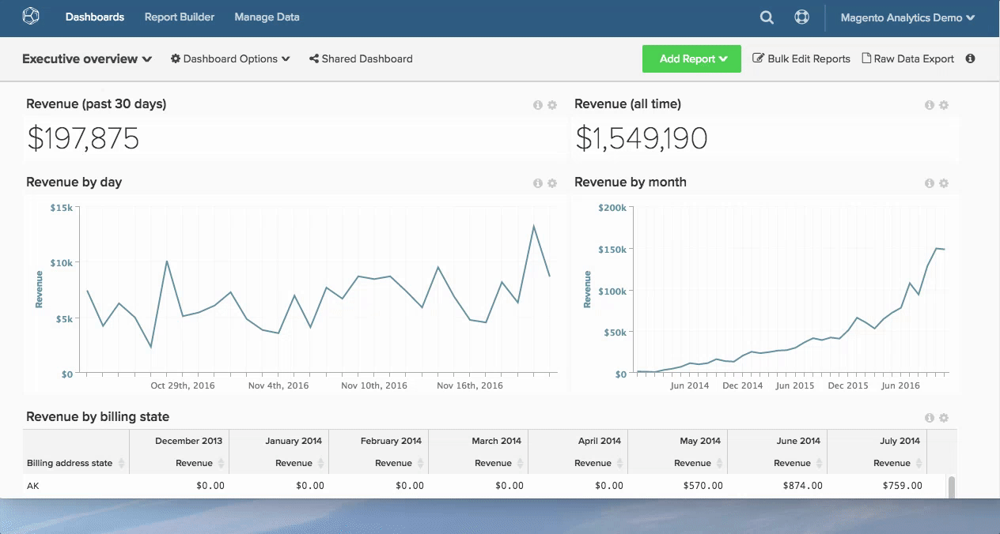

# 使用报表

在中使用报表 [!DNL MBI] 帮助您解答业务问题 — 无论您是只想查看本月与去年相比的收入，还是了解您的最新客户获取成本 [!DNL Google AdWords] 营销活动。

从问题到答案的路是什么？

为了帮助您可视化此过程，我们在下面映射了该路由。 本主题将介绍我们如何处理分析问题，以及获取您所需数据所需的后端物流。

## 从问题开始

我们知道，您不断提出问题以改进您的业务，从提高客户满意度到降低供应成本。 我们将重点介绍如何将您的问题转化为有助于您做出决策的分析。

例如，我们假定我们想回答以下问题：

* 我的新注册者转化速度如何？

## 识别测量

在我们的问题掌握后，现在该确定一份可能的分析和衡量的清单，以帮助回答这个问题。 在本例中，请重点关注以下量度：

* 每次使用从注册到首次购买日期的平均时间。

这将显示注册日期与用户首次购买日期之间的间隔平均时间，并说明用户在转化漏斗的最后一步中的行为方式。

## 查找数据

了解要衡量的只能让我们在那里找到一部分。 要评估从注册到每位用户首次购买日期的平均时间，我们需要确定我们的衡量指标包含的所有数据点。

将我们的指标划分为核心组件：我们需要知道注册人数或人数；购买商品的人数；以及这两个事件之间经过的时间。

在更高的级别，我们需要知道在数据库中的何处查找此数据，具体是：

* 每次有人注册时记录一行数据的表
* 每次有人购买时记录数据行的表
* 可用于连接或引用 `purchase` 表格 `customer` 表 — 这样，我们就可以知道谁购买了产品

在更精细的粒度级别，我们需要确定将用于此分析的准确数据字段：

* 包含客户注册日期的数据表和列：例如 `user.created\_at`
* 包含购买日期的数据表和列：例如 `order.created\_at`

## 创建数据列以供分析

除了上述本机数据列之外，我们还需要一组计算数据字段才能启用此分析，包括：

* `Customer's first purchase date` 返回特定用户的 `MIN(order.created_at`)

然后，将使用该参数创建：

* `Time between a customer's registration date and first purchase date`，可返回特定用户在注册日期至首次购买日期之间已经过的时间。 这将成为以后量度的基础。

这两个字段都需要在用户级别创建(例如， `user` 表)，以便平均分析可以按用户进行标准化（换言之，此平均计算中的分母将为用户计数）。

这里是 [!DNL MBI] 进去！ 您可以利用 [!DNL MBI] data warehouse创建上述列。 只需联系我们的分析团队，并为我们提供新列的具体定义，我们便会创建它们。 您还可以利用我们的 [列编辑器](../../data-analyst/data-warehouse-mgr/creating-calculated-columns.md).

最佳做法是避免直接在数据库中创建这些计算数据字段，因为它给生产服务器带来了不必要的负担。

## 创建量度

既然我们拥有进行分析所需的数据字段，那么就该找到或创建相关量度来构建分析了。

在这里，我们知道，在数学上，我们想要执行以下计算：

_[总和 `Time between a customer's registration date and first purchase date`] / [注册和购买的客户总数]_

我们希望看到这个计算是随时间绘制的，或根据客户注册日期显示的趋势。 下面是如何 [创建此量度](../../data-user/reports/ess-manage-data-metrics.md) in [!DNL MBI]:

1. 转到 **[!UICONTROL Data]** ，然后选择 `Metrics` 选项卡。
1. 单击 **[!UICONTROL Add New Metric]** ，然后选择 `user` 表格（我们在其中创建了上述维度）。
1. 从下拉菜单中，选择 `Average` 在`Time between a customer's registration date and first purchase date` 列 `user` 表按排序 `Customer's registration date`  列。
1. 添加任何相关的过滤器或过滤器集。

此量度现已准备就绪。

## 创建报告

设置新量度后，我们可以使用它来报告从注册到首次购买日期之间的平均时间（按注册日期）。

只需转到任何功能板和 [创建新报表](../../data-user/reports/ess-manage-data-metrics.md) 使用上面创建的量度。

### `Visual Report Builder` {#visualrb}

[的 `Visual Report Builder`](../../data-user/reports/ess-rpt-build-visual.md) 是显示数据的最简单方法。 如果您不熟悉SQL或只想快速创建报表，则最好选择可视Report Builder。 只需单击几下，您即可在整个组织中添加量度、对数据进行分段并创建报表。 此选项非常适合初学者和专家，因为它不需要任何技术专业知识。

|  |  |
|--- |--- |
| **这是完美的……** | **这对……** |
|  — 所有级别的分析/技术体验  — 快速创建报告  — 创建分析以与其他用户共享 |  — 需要特定于SQL的函数的分析  — 测试新列 — 计算列取决于初始数据填充的更新周期，而使用SQL创建的列则不依赖于更新周期 |

{style=&quot;table-layout:auto&quot;}

### 报表描述和图像

#### 向报表添加描述

在创建将与您团队的其他成员共享的报表时，我们建议添加描述，以便其他用户能够更好地了解您的分析。

1. 单击 **[!UICONTROL i]** 中。
1. 在字框中输入描述。
1. 单击 **[!UICONTROL Save Description]**.

让我们看看：

#### 将报表导出为图像

需要在演示文稿或文档中包含报表？ 任何报表均可使用 `Report Options` 菜单（位于每个报表的右上角）。

1. 单击任何报表右上角的齿轮图标。
1. 从下拉菜单中，选择 `Enlarge`.
1. 当报告放大时，单击 **[!UICONTROL Download]** 中。
1. 从下拉菜单中选择首选的图像格式。 下载将立即开始。

看看：

