# 可视化选项

为给定数据集选择正确的可视化图表是分析过程中的关键部分。 每个数据集都有一个故事需要讲述，但故事的效果通过其视觉影响和可读性得到强调。

此 [!DNL Commerce Intelligence] [!DNL Visual Report Builder] 提供了12个不同的可视化选项，每个选项都具有各自的优势和用例。 本主题讨论中的各种可视化选项 [!DNL Commerce Intelligence]，包括所需的报表配置（如果适用）和用例示例。 以下可视化图表可在 [!DNL Commerce Intelligence]：

* `Scalar`
* `Table`
* `Line`
* `Bar`
* `Stacked Bar`
* `Column`
* `Stacked Column`
* `Pie`
* `Area`
* `Funnel`
* `Scatter plot`
* `Bubble`
* `Heatmap`

## `Scalar`

`Scalar` 报表显示为单个数字值。 大多数情况下，它用于显示关键量度（如收入或订单）的“全时”值，或者使用两个单独的标量报表来比较至今的收入与预算。 在下面的示例中，它只显示给定报告时间间隔内的订单总数：

要将报表另存为标量，请配置筛选器和时间设置，然后单击 **[!UICONTROL Save]** 或 **[!UICONTROL Update]** 报表的右上角部分。 在 `Type` 在下拉列表中，选择数字：量度名称，以将报表另存为左侧栏中显示的值。

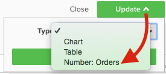

**要求**：

* `Time interval`: `None`
* `Group by`: `None`
* 仅一个量度

## `Table`

顾名思义， `table` 报告非常适合显示表格详细信息。 当需要在单个报表中按值或量度显示多个组时，表格通常是最佳途径。 例如，下方是“客户详细信息”表，其中显示了按客户电子邮件分组的订单和收入：

与标量报表类似，您可以通过单击将报表另存为表 **[!UICONTROL Save]** 或 **[!UICONTROL Update]** 在Report Builder中，选择 `Type` 下拉菜单。

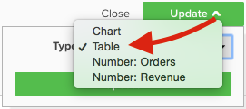

**要求：**

* 尽管没有报告配置要求，但请务必注意，表限制为3500行。 如果数据集包含超过3500行，则需要筛选结果以缩小范围，或将这些结果导出到 `.csv` 或 `Excel` 以查看完整数据集。

## `Line`

`Line` 图表是比较类似量度同类群组性能的完美选择。 例如，分析两个地区在相同时段的收入，或比较已履行订单的逐年增长，如下所示：

添加到报表中的每个量度和公式由其自己的行表示。 在比较具有相似单位和规模的量度时，不要忘记清除复选框 `Multiple Y-Axes` 以按相同比例显示所有量度。

要将报表另存为折线图，请调整报表 `Type` 到 `Chart`，然后从Report Builder中选择适当的可视化图表，如下所示：

**要求：**

* 无

## `Bar`

`Bar` 图表将数据显示为一系列水平条，最适合显示有限数量的量度或按值分组的整体性能。 例如，可以使用条形图来按商店比较收入：

每个不同的量度、分组依据和时间间隔组合都显示为自己的栏。 如果您有两个指标，但只有一个指标 `group by`，包含三个不同的 `group by` 值，您的报表会显示六个单独的条。

要将报表另存为条形图，请调整报表 `Type` 到 `Chart` 并选择 `Bar` 选项，如下所示：

**要求：**

* 无

## `Stacked Bar`

`Stacked bar` 图表与其条形图兄弟类似，具有显示每个条形按比例细分的附加功能。 通常，栈叠条形图使用两个或多个量度和单个分组依据进行设置，以使每个条形表示按值划分的唯一分组，该值在其量度组成部分之间拆分。

例如，以下报表具有两个相同的收入量度，一个针对首次订购进行过滤，另一个针对重复订购进行过滤。 按商店进行分组后，您可以看到每个商店的总收入贡献（由栏的总宽度表示）以及每个商店的第一次与重复收入细分。

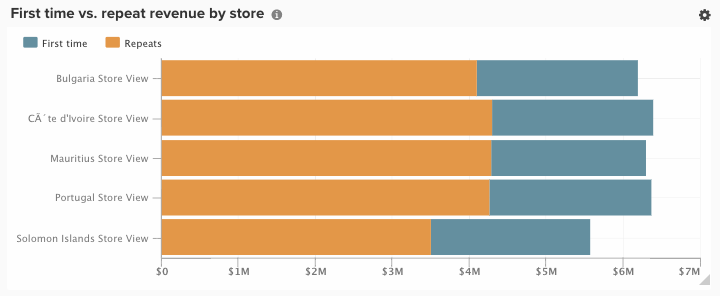

确保 `Multiple Y-Axes` 框在设置如上所述的报告时处于未选中状态。

要将报表另存为栈叠条形图，请调整报表 `Type` 到 `Chart` 并从Report Builder中选择栈叠条形图选项：

**要求：**

* 无

## `Column`

`Column` 图表将每个数据点表示为一个垂直列，与水平条形图可视化图表相比，它更适合显示时间趋势数据。 每个唯一的量度和按组合分组都用其自己的条形系列表示。 列报表最好包含1-3个按值分组，从而适用于具有三个或更少量度或一个具有单个分组的量度的报表。

在下面的示例中，您看到两个收入量度，一个针对首次收入进行筛选，另一个针对重复收入进行筛选，并按月显示一段时间内的趋势：

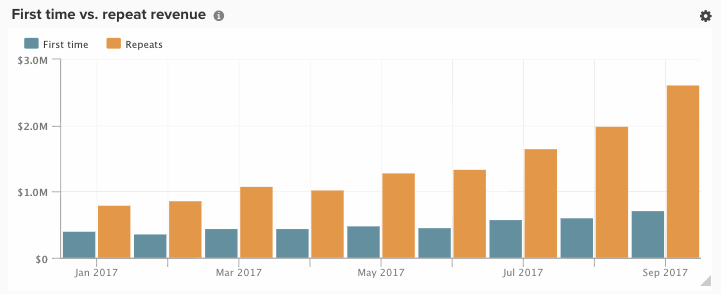

列报告可通过更改报告进行保存 `Type` 到 `Chart`，然后选择列可视化图表选项：

**要求：**

* 无

## `Stacked Column`

`Stacked column` 报表与柱形图几乎完全相同，不同之处在于，相似的列彼此栈叠在一起，因此总高度表示值的总和。 栈叠的列再次通过有限数量的量度或组框实现最佳可视化。

使用中所述的相同报表配置 `Column` 部分，具有两个收入量度（首次过滤并重复）的报表将类似于下面的示例，其中包含栈叠的列可视化图表：

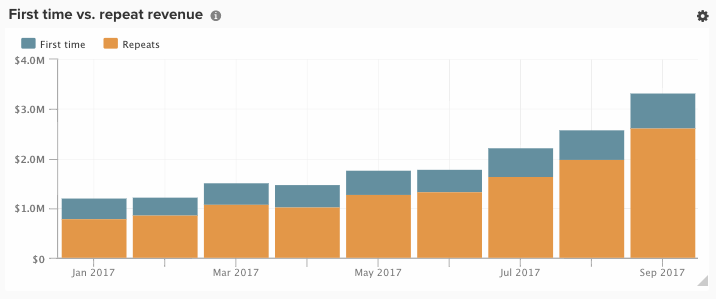

同样重要的是， `Multiple Y-Axes` 使用栈叠列可视化显示多个量度时，复选框被清除。

要将报表另存为栈叠列，请设置该报表 `Type` 到 `Chart` 并选择 `stacked column` 选项：

**要求：**

* 无

## `Pie`

`Pie` 图表最适合显示具有一个或多个组框的单个量度，或者显示没有组框的多个量度。 在任一情况下，时间间隔必须设置为none才能在饼图中显示数据。 在以下示例中，单个订单量度按商店名称分组，以显示按商店划分的订单细分：

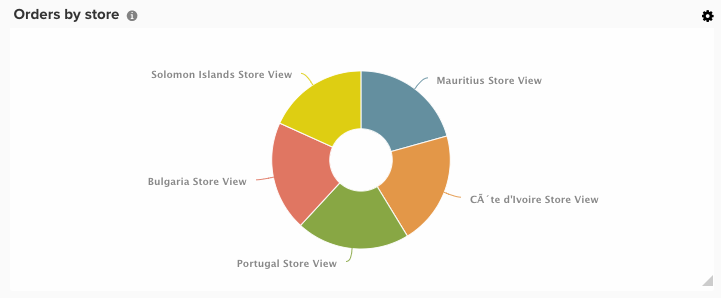

要将报表另存为饼图，请设置该报表 `Type` 到 `Chart` 并选择 `pie` 选项，如下所示：

**要求：**

* `Time interval`: `None`
* 以下任一项：
   * `Single metric with one or more group bys`
   * `Multiple metrics with no group bys`

## `Area`

`Area` 图表与栈叠式柱状图几乎完全相同，只是列会连续显示。 与栈叠列类似，面积图最好通过有限数量的组框或指标实现可视化。

从以下示例中获取相同的示例： `stacked column` 部分，以下报表使用面积图可视化图表显示首次收入与重复收入：

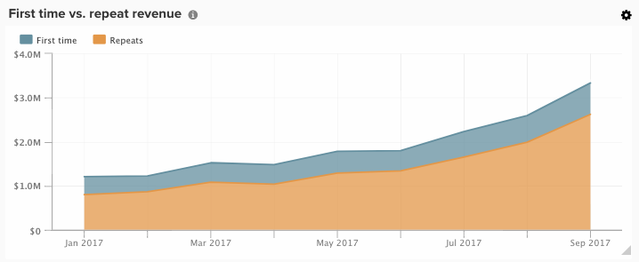

要将报表另存为面积图，请调整 `Type` 到 `Chart` 并选择区域选项：

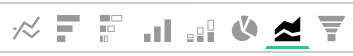

**要求：**

* 无

## `Funnel`

`Funnel` 图表非常适合用于可视化预期事件序列中的转化。 一些示例包括分析销售漏斗中从商机到成交的潜在收入，或衡量客户在第一订单和第二订单、第二订单和第三订单之间的降幅，等等。 后者的示例如下：

在漏斗报表中，漏斗的给定步骤的相对值由步骤的高度反映。 报告配置确定步骤的显示顺序。 有两种方法可配置漏斗报表：

* `Single metric with one group by`： — 由group by的“Show Top/Bottom”设置确定的步骤顺序。 默认情况下，漏斗步骤按从最大值到最小值的顺序显示，但您也可以按名称的组按字母顺序对它们进行排序。

* `Multiple metrics with no group by`： — 步骤顺序，由指标添加到报表的顺序确定。

要将报表另存为漏斗图，请调整报表 `Type` 到 `Chart` 并从Report Builder中选择适当的可视化图表。

**要求：**

* `Time interval`: `None`
* 以下任一项：
   * `Single metric with one group by`
   * `Multiple metrics with no group by`

## `Scatter plot`

A `scatter plot` 用于检查量度与两个不同变量的关系，以便轻松识别关联和离群值。 此类可视化图表最好仅用于数字维度 — 请尝试使用“订单”量度和 `Customer's lifetime number of coupons` 和 `Customer's lifetime revenue` 维度以了解优惠券使用与收入的关系。 您可以选择使用或不使用趋势线的散点图：

**要求：**

选项1：

* 二 `metrics`
* 一个 `group by`
* `Time interval`: `None`

选项2：

* 二 `metrics`
* 否 `group by`
* 设置 `time interval`

## `Bubble` 图表

A `bubble` 图表最多可显示四个维度的数据，其中 `X` 和 `Y` 轴指定气泡的位置。 此 `Z` axis是气泡的大小，通过包含两个组bys，可以向气泡中添加颜色。 当您想要在单个图表中绘制多维数据时，最好使用此类型的可视化图表。

例如，下图显示了按特定客户获取源（气泡颜色）和状态（特定颜色的各种气泡）分组的客户数量（气泡大小），并按总收入和平均存留期订单绘制。

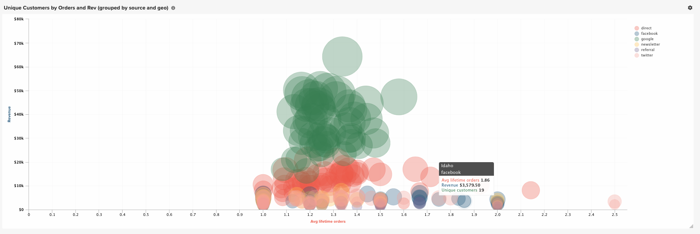

下图显示了按客户获取源（气泡颜色）和状态（特定颜色的各种气泡）分组的客户数量（气泡大小），并按照平均生命周期值和总收入绘制。

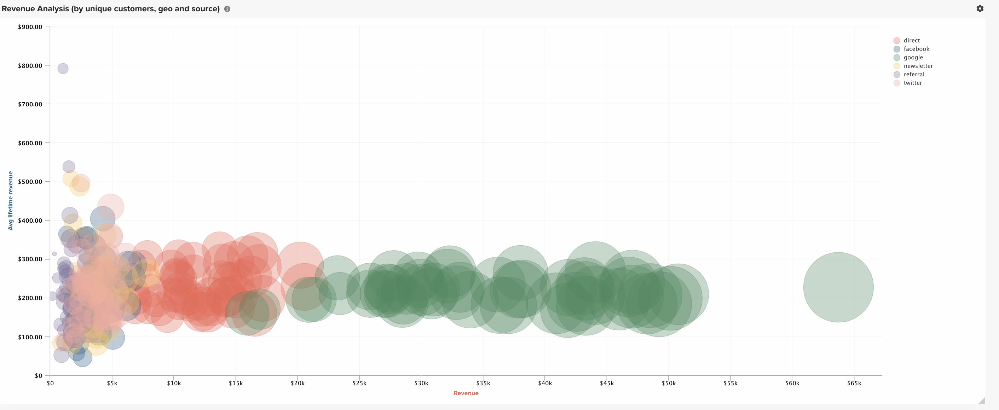

**单系列泡泡图的要求：**

选项1

* 三 `metrics`
* 一个 `group by`
* `Time interval`: `None`

选项2

* 三 `metrics`
* 否 `group by`
* 设置 `time interval`

**多系列泡泡图的要求：**

* 三 `metrics`
* 二 `group by`
* `Time interval`: `None`

## `Heatmap`

使用 `heatmaps` 以可视化数据中的热点。 例如，热图可指示您通常在何处获得更高的热量。 将这些数据可视化，可以帮助您调整库存水平，以确保满足这些高峰期期间的需求。

以下热图汇总显示几周内按星期几、按小时划分的订单。

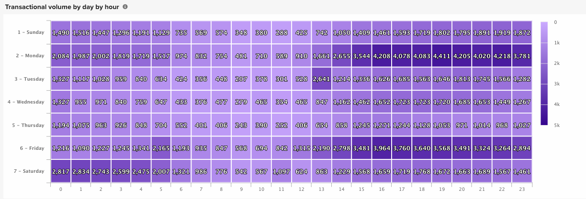<!--{: width="650"}-->

**要求：**

选项1

* 一个 `metric`
* 二 `group by`
* `Time interval`: `None`

选项2

* 一个 `metric`
* 一个 `group by`
* 设置 `time interval`
