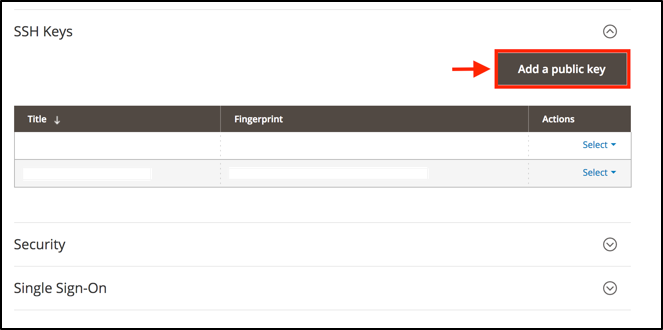

# 激活您的 [!DNL MBI] 帐户 `Cloud Starter` 订阅

激活 [!DNL MBI] 对象 `Cloud Starter` 项目，首先创建 [!DNL MBI] 帐户，然后创建 `SSH` 键，最后连接到您的Commerce数据库。 参见 [激活内部部署订阅](../getting-started/onpremise-activation.md).

>[!NOTE]
>
>有关激活的帮助 [!DNL MBI] 对象 `Cloud Pro` 项目，请联系您的Adobe客户团队或客户技术顾问。

1. 创建您的 [!DNL MBI] 帐户。

   - 转到 [Adobe Commerce帐户登录](https://account.magento.com/customer/account/login)

   - 转到 **[!UICONTROL My Account** > **My [!DNL MBI] Instances]**.

   - 单击 **[!UICONTROL Create Instance]**. 如果您没有看到此按钮，请与您的Adobe客户团队或客户技术顾问联系。

   - 选择您的 `Cloud Starter` 订阅。 如果您只有 `cloud starter` 订阅，这是默认选项。

   - 单击 **[!UICONTROL Continue]**.

   - 输入您的信息以创建您的帐户。

   

   - 转到收件箱并验证您的电子邮件地址。

   

   - 创建密码。

   

   - 创建帐户后，您可以将用户添加到新帐户。 现在可以添加技术管理员以执行以下步骤。

   

1. 输入有关商店的信息以设置首选项。

   

   在连接数据库以进行入门培训流程中的第三步之前，请收集一些信息。 您完成 `Connect your database` 步骤9中的页面。

1. 创建专用 [!DNL MBI] 用户。

   - 在中创建用户 [Adobe Commerce帐户](https://account.magento.com/customer/account/login).

   - _为什么是新用户？_ [!DNL MBI] 需要添加到项目的用户不断获取要传输到帐户的新数据 [!DNL MBI] data warehouse。 此用户将用作该连接。 步骤4中介绍了如何将此用户添加到项目。

   - 为什么有一个专门的 [!DNL MBI] 用户是防止添加的用户被意外停用或删除，并停止 [!DNL MBI] 连接。

1. 将新创建的用户作为添加到项目的主环境 `Contributor`.

   

1. 获取您的 [!DNL MBI] `SSH` 键。

   - 转到 `Connect your database` 第页，共 [!DNL MBI] 设置用户界面并向下滚动到 `Encryption settings`.

   - 对于 `Encryption Type` 字段，选择 `SSH Tunnel`.

   - 从下拉菜单中，您可以复制并粘贴提供的 [!DNL MBI] `Public Key`.

   

1. 添加新 [!DNL MBI] `Public key` 到 [!DNL MBI] 步骤5中创建的用户。

   - 转到 [您的cloud Adobe Commerce帐户](https://account.magento.com/cloud/customer/login/). 使用您的新帐户登录信息登录 [!DNL MBI] 用户已创建。 然后转到 `Account Settings` 选项卡。

   - 向下滚动页面，并展开下拉菜单，以查看 `SSH` 键。 然后单击 **[!UICONTROL Add a public key]**.

   

   - 添加 [!DNL MBI] `SSH Public Key` 从上面。

   

1. 提供 [!DNL MBI] MySQL凭据。

   - 更新您的 `.magento/services.yaml`

   ```sql
   mysql:
       type: mysql:10.0
       disk: 2048
       configuration:
           schemas:
               - main
           endpoints:
               mysql:
                   default_schema: main
                   privileges:
                       main: admin
               mbi:
                   default_schema: main
                   privileges:
                       main: ro
   ```

   - 更新您的 `.magento.app.yaml`

   ```sql
           relationships:
               database: "mysql:mysql"
               mbi: "mysql:mbi"
               redis: "redis:redis"
   ```

1. 获取用于将数据库连接到 [!DNL MBI].

   运行
   `echo $MAGENTO_CLOUD_RELATIONSHIPS | base64 --decode | json_pp`

   以获取有关连接数据库的信息。

   您应会收到类似于以下输出的信息：

   ```json
           "mbi" : [
                 {
                    "scheme" : "mysql",
                    "rel" : "mbi",
                    "cluster" : "vfbfui4vmfez6-master-7rqtwti",
                    "query" : {
                       "is_master" : true
                    },
                    "ip" : "169.254.169.143",
                    "path" : "main",
                    "host" : "[!DNL MBI].internal",
                    "hostname" : "3m7xizydbomhnulyglx2ku4wpq.mysql.service._.magentosite.cloud",
                    "username" : "mbi",
                    "service" : "mysql",
                    "port" : 3306,
                    "password" : "[password]"
                 }
              ],
   ```

1. 连接Commerce数据库

   

   - `Integration Name`： [选择集成的名称。]

   - `Host`: `[!DNL MBI].internal`

   - `Port`: `3306`

   - `Username`: `mbi`

   - `Password`： [步骤8的输出中提供的输入密码。]

   - `Database Name`: `main`

   - `Table Prefixes`： [如果没有表前缀，则保留为空]

1. 设置您的时区设置。

   

   - `Database`: `Timezone: UTC`

   - `Desired Timezone`： [选择您希望数据显示的时区。]

1. 获取有关加密设置的信息。

   - 项目用户界面提供 `SSH` 访问字符串。 此字符串可用于收集以下项目所需的信息： `Remote Address` 和 `Username` 在设置 `Encryption` 设置。 使用 `SSH Access` 通过单击项目UI的主要分支上的“访问站点”按钮找到的字符串，并查找 `User Name` 和 `Remote Address` 如下所示。

   

   

1. 输入您的信息 `Encryption` 设置

   

   **输入**

   - `Encryption Type`: `SSH Tunnel`

   - `Remote Address`: `ssh.us-3.magento.cloud`

   - `Username`: `vfbfui4vmfez6-master-7rqtwti--mymagento`

   - `Port`: `22`

1. 单击 **[!UICONTROL Save Integration]**.

1. 您现在已成功连接到 [!DNL MBI] 帐户。

1. 成功连接后 [!DNL MBI] 对于Commerce数据库，请联系您的Adobe客户团队以协调后续步骤，例如设置集成和其他配置步骤。

1. 完成配置后，您可以 [登录](../getting-started/sign-in.md) 敬您的 [!DNL MBI] 帐户。
