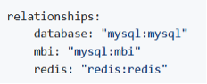

# 为内部部署和入门订阅激活您的[!DNL Commerce Intelligence]帐户

要为本地订阅激活[!DNL Commerce Intelligence]，请先创建[!DNL Commerce Intelligence]帐户，输入设置信息，然后将[!DNL Commerce Intelligence]连接到您的[!DNL Commerce]数据库。<!-- For information about activation in `Cloud Starter` projects, see [Activating your [!DNL Commerce Intelligence] Account for `Cloud Starter` Subscriptions](../getting-started/cloud-activation.md).-->

## 创建您的[!DNL Commerce Intelligence]帐户

要创建您的帐户，请联系您的Adobe客户团队或客户技术顾问。

## 创建密码

创建帐户后，请查看您的电子邮件中是否有来自[!DNL The Magento BI Team@rjmetrics.com]的帐户通知电子邮件。 使用电子邮件中提供的链接访问您的[!DNL Commerce Intelligence]帐户并创建密码。 转到您的收件箱并验证您的电子邮件地址。

如果未收到电子邮件，请[联系支持人员](https://experienceleague.adobe.com/docs/commerce-knowledge-base/kb/troubleshooting/miscellaneous/mbi-service-policies.html?lang=en)。

## 设置您的商店首选项

在配置数据库连接之前，请填写存储信息表单。 需要此信息才能完成&#x200B;**[!UICONTROL Connect your Database]**&#x200B;安装。

## 添加[!DNL Commerce Intelligence]用户

在设置密码并登录[!DNL Commerce Intelligence]后，您可以将其他用户添加到您的[!DNL Commerce Intelligence]帐户。 添加用户时，添加具有适当权限的管理用户以完成激活过程。

## 在[!DNL Commerce Intelligence]管理员中创建专用[!DNL Commerce]用户

要使用[!DNL Commerce Intelligence]，您必须向[!DNL Commerce]项目添加永久和专用用户。 此专用用户充当与[!DNL Commerce]的永久连接，允许提取新数据并将其传输到帐户的[!DNL Commerce Intelligence] Data Warehouse。

配置专用[!DNL Commerce Intelligence]用户可确保不会停用或删除该帐户，从而停止[!DNL Commerce Intelligence]连接。

>[!NOTE]
>
>Adobe鼓励使用表明其永久状态的帐户名称（例如ACI-dedicated、ACI-database-connector等）。

在管理员中为[!DNL Commerce Intelligence]创建专用用户后，将同一用户添加到[!DNL Commerce]项目的主环境，其中的&#x200B;**[!UICONTROL Master]**&#x200B;设置为`Contributor`。

## 获取Commerce Intelligence SSH密钥

1. 在[!UICONTROL Connect your database]设置的[!DNL Commerce Intelligence]页面上，向下滚动并选择&#x200B;**[!UICONTROL Encryption settings]**。

1. 对于&#x200B;**加密类型**，请选择`SSH Tunnel`。

1. 从下拉菜单中，复制提供的公共密钥。

   

## 将您的公钥添加到[!DNL Commerce Intelligence]

1. 从[!DNL Commerce Admin]，使用刚刚创建的[!DNL Commerce Intelligence]用户的登录信息登录。

1. 选择&#x200B;**帐户设置**&#x200B;选项卡。

1. 向下滚动并展开&#x200B;**[!UICONTROL SSH Keys]**&#x200B;下拉列表。 然后选择&#x200B;**[!UICONTROL Add a public key]**。

   

1. 粘贴您在上面的[!DNL Encryption Type]步骤中复制的公钥。

   

## 提供[!DNL Commerce Intelligence] Essentials `MySQL`凭据

1. 更新您的`.magento/services.yaml`。

   

1. 更新您的`.magento.app.yaml`。

   

## 获取数据库连接信息

获取到[!DNL Commerce]数据库的数据库连接信息到[!DNL Commerce Intelligence]

1. 运行以下命令以获取您的信息。

   `echo $MAGENTO_CLOUD_RELATIONSHIPS | base64 --decode | json_pp`

1. 查看数据库信息，这些信息应该与以下示例类似。

   

## 使用加密连接将[!DNL Commerce Intelligence]连接到[!DNL Commerce]数据库

>[!NOTE]
>
>Adobe强烈建议您使用[`SSH tunnel`](../data-analyst/importing-data/integrations/mysql-via-ssh-tunnel.md)隧道建立数据库连接。 但是，如果此方法不是选项，您仍然可以使用[!DNL Commerce Intelligence]将[`direct connection`](../data-analyst/importing-data/integrations/mysql-via-a-direct-connection.md)链接到数据库。

在[!DNL Commerce Intelligence]屏幕中输入您的[!UICONTROL Connect your Magento Database]信息。

**输入：**

[!UICONTROL Integration Name]： [为您的[!DNL Commerce Intelligence]实例选择一个名称]

[!UICONTROL Host]: `mbi.internal`

[!UICONTROL Port]: `3306`

[!UICONTROL 用户名]: `mbi`

[!UICONTROL Password]：在上一部分中显示了[输入密码]

[!UICONTROL Database Name]: `main`

[!UICONTROL Table Prefixes]：如果没有表前缀，[留空]

## 设置您的&#x200B;[!UICONTROL **时区**]&#x200B;设置

**输入：**

[!UICONTROL Database Timezone]: `UTC`

[!UICONTROL Desired Timezone]： [选择您希望数据显示的时区]

## 获取加密设置信息

项目UI提供SSH访问字符串。 此字符串可用于收集&#x200B;[!UICONTROL **远程地址**]&#x200B;和&#x200B;[!UICONTROL **用户名**]&#x200B;所需的信息。 通过在项目UI的主分支上选择访问站点按钮，使用SSH访问字符串。 然后，查找您的[!UICONTROL User Name]和[!UICONTROL Remote Address]，如下所示。

## 输入您的[!DNL Encryption]设置

**输入：**

[!UICONTROL Encryption Type]： `SSH Tunnel`

[!UICONTROL Remote Address]： `ssh.us-3.magento.cloud` [来自上一步]

[!UICONTROL Username]： `vfbfui4vmfez6-master-7rqtwti—mymagento` [来自上一步]

[!UICONTROL Port]: `22`

## 保存您的集成。

完成配置步骤后，选择&#x200B;[!UICONTROL **保存集成**]&#x200B;以应用更改。

您现在已成功将[!DNL Commerce]数据库连接到[!DNL Commerce Intelligence]帐户。

>[!NOTE]
>
>如果您是[!DNL Adobe Commerce Intelligence Pro]客户，请联系您的客户成功经理或客户技术顾问来协调后续步骤。

完成配置后，请[登录](../getting-started/sign-in.md)您的[!DNL Commerce Intelligence]帐户。

<!---# Activate your [!DNL Commerce Intelligence] Account 

To activate [!DNL Commerce Intelligence] for on-premise or `Cloud Pro` subscriptions, [contact support](https://experienceleague.adobe.com/docs/commerce-knowledge-base/kb/troubleshooting/miscellaneous/mbi-service-policies.html).

>[!NOTE]
>
>Adobe no longer supports new `Cloud Starter` subscriptions.--->
