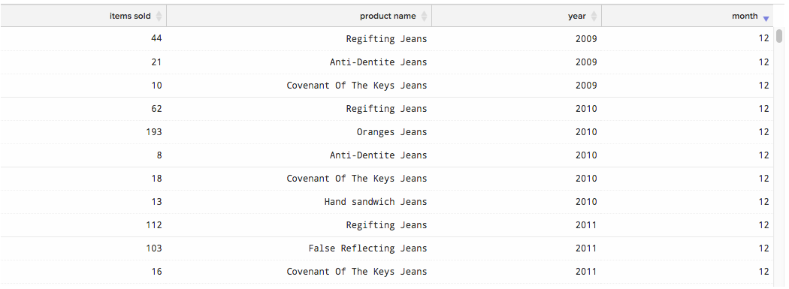
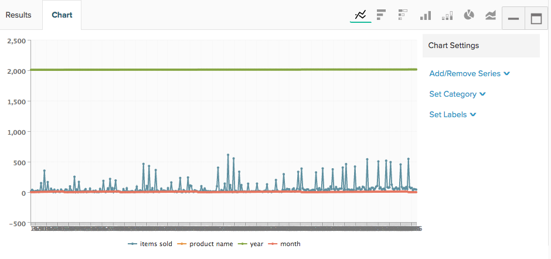
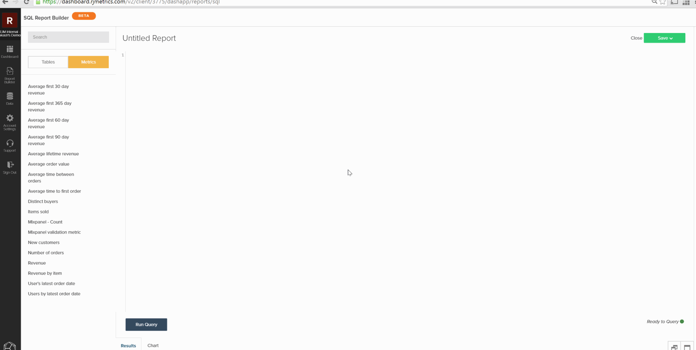
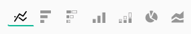

# 从SQL查询创建可视化

本教程的目标是熟悉 `SQL Report Builder` 为创建 `SQL visualizations`.

的 [`SQL Report Builder`](../data-analyst/dev-reports/sql-rpt-bldr.md) 是具有以下选项的报表生成器：您可以运行查询以仅检索数据表，也可以将这些结果转换为报表。 本教程介绍如何从SQL查询构建可视化。

## 术语

在开始本教程之前，请参阅 `SQL Report Builder`.

- `Series`:要测量的列在SQLReport Builder中称为系列。 常见示例包括 `revenue`, `items sold`和 `marketing spend`. 必须至少将一列设置为 `Series` 创建可视化。

- `Category`:要用于对数据进行分段的列称为 `Category` 这就像 `Group By` 功能 [`Visual Report Builder`](../data-user/reports/ess-rpt-build-visual.md). 例如，如果要按客户的客户获取来源划分客户的生命周期收入，则包含客户获取来源的列将指定为 `Category`. 多列可设置为 `Category`.

>[!NOTE]
>
>日期和时间戳也可用作 `Categories`. 它们只是查询中的另一列数据，必须根据需要在查询中设置格式并排序。

- `Labels`:它们将作为x轴标签应用。 在分析一段时间内的数据趋势时，年和月列通常指定为标签。 可以将多列设置为“标签”。

## 步骤1:编写查询

请记住以下事项：

- 的 `SQL Report Builder` 使用 [`Redshift SQL`](https://docs.aws.amazon.com/redshift/latest/dg/c_redshift-and-postgres-sql.html).

- 如果要创建包含时间系列的报表，请务必 `ORDER BY` 时间戳列。 这将确保时间戳按报表的正确顺序绘制。

- 的 `EXTRACT` 函数非常适用于解析时间戳的日期、周、月或年。 当 `time interval` 要在报表中使用的 `daily`, `weekly`, `monthly`或 `yearly`.

要开始配置，请打开 `SQL Report Builder` 单击 **[!UICONTROL Report Builder** > **SQL Report Builder]**.

例如，请考虑以下查询，该查询返回每个产品每月销售的项目总数：

```sql
    SELECT SUM("qty") AS "Items Sold", "products's name" AS "product name",
    EXTRACT(year from "Order date") AS "year",
    EXTRACT(month from "Order date") AS "month"
    FROM "items"
    WHERE "products's name" LIKE '%Jeans'
    GROUP BY  "products's name", "year","month"
    ORDER BY "year" ASC,"month" ASC
    LIMIT 3500
```

此查询将返回以下结果表：



## 步骤2:创建可视化

有了这些结果， *如何创建可视化图表？* 要开始配置，请单击 **[!UICONTROL Chart]** 选项卡 `Results` 中。 这将显示 `Chart settings` 选项卡。

首次执行查询时，报表可能看起来不可理解，因为查询中的所有列都以系列形式标绘：



在本例中，我们希望它是一个随时间变化的折线图。 要创建该报表包，请使用以下设置：

- `Series`:选择 `Items sold` 列 `Series` 因为我们想量一下。 在定义 `Series` 列中，您将看到报表中绘制的一条线。

- `Category`:在本例中，我们希望将每个产品作为不同的行显示在报表中。 为此，我们设置 `Product name` 作为 `Category`.

- `Labels`:使用列 `year` 和 `month` 作为x轴上的标签，以便能够查看 `Items Sold` 随时间推移的趋势。

>[!NOTE]
>
>查询必须包含 `ORDER BY` 标签上的子句（如果它们是） `date`/`time` 列。

下面简要介绍了我们如何创建此可视化图表（从运行查询到设置报表）：



## 步骤3:选择 `Chart Type`

此示例使用 `Line` 图表类型。 使用其他 `chart type`，请单击图表选项部分上方的图标以对其进行更改：



## 步骤4:保存可视化

如果要再次使用此报表，请为报表提供一个名称并单击 **[!UICONTROL Save]** 中。

在下拉菜单中，选择 `Chart` 作为 `Type` 然后是功能板，用于将报表保存到。

## 恭喜！ 你完了。

想进一步吗？ 查看 [查询优化最佳实践](../best-practices/optimizing-your-sql-queries.md).
