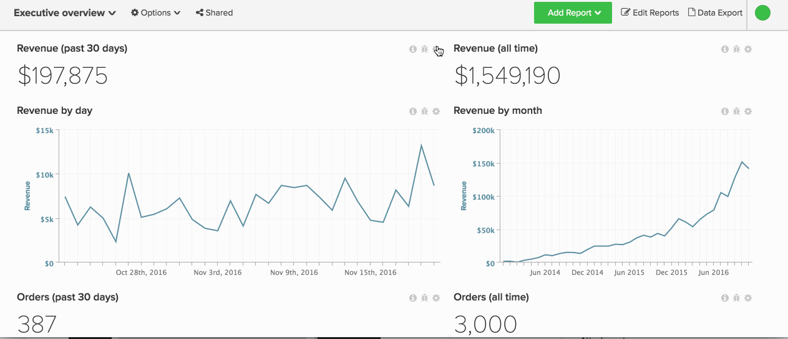
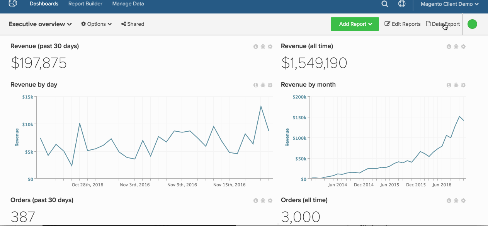

# 导出原始数据

通过使用原始数据导出，您可以从Data warehouse中导出记录，以便更详细地了解为您的仪表板提供支持的功能。 此外，原始数据导出还可以帮助您 [精确定位数据差异](https://experienceleague.adobe.com/docs/commerce-knowledge-base/kb/troubleshooting/miscellaneous/using-data-exports-to-pinpoint-discrepancies.html).

通过原始数据导出，可以访问通过取消标准化和预聚合相关量度生成的其他列和维度。 例如， `User's first order date` 是可为每个用户导出的维度 [!DNL Commerce Intelligence]，尽管它可能在数据库中不可用。

本教程涵盖以下内容：

* [选择要导出的数据](#select)
* [正在下载导出(](#download)
* [访问历史导出](#historical)

## 步骤1：选择要导出的数据 {#select}

有两种方法可以在中导出原始数据 [!DNL Commerce Intelligence]：

1. 在图表级别
1. 在表级别

### 在中在表级别导出 [!UICONTROL Manage Data] 选项卡

如果要从中导出表，请执行以下操作 [!UICONTROL Manage Data] 选项卡，您需要 [管理员](../administrator/user-management/user-management.md) 权限。

1. 单击 **[!UICONTROL Manage Data** > **&#x200B;导出数据&#x200B;**> **原始数据导出]**.
1. 您会看到 `Export List` 最近创建的数据导出的（如果存在）。 单击 **[!UICONTROL Add Export]** 以创建导出。
1. 此 `New Raw Data Export` 对话框随即显示。 在此，您可以通过选择或取消选择列和筛选器来自定义导出：

   * `Table` - `Table` 字段选择从中导出数据的表。 默认情况下，将显示您导航到的表。
   * `Export Name`  — 在此字段中，输入导出的名称。 例如： `Philadelphia - Daily Revenue`.
   * `Available Columns`  — 此字段列出数据库中可包含在导出中的列（维度）。 要添加列，请单击其名称。
   * `Selected Columns`  — 此字段列出当前包含在导出中的列（维度）。 要删除列，请单击其名称。
   * `Filter`  — 此部分列出当前应用于导出的过滤器。 这些筛选器可以更改；还可以添加新的筛选器以导出特定数据集。
   * 完成后，单击 **[!UICONTROL Export Data]**.

### 从功能板在图表级别导出

1. 单击任何图表右上角的齿轮图标。

1. 选择 `Raw Export` 以显示 `Raw Export` 对话框。

1. 通过选择 `table`， `columns`、和 `filters` 以包含或排除。 有关本模块中字段的更多详细信息，请参阅上一节。

   >[!NOTE]
   >
   >显示在中的表 `Table` 默认情况下，字段是支持图表的表。

1. 完成后，单击 **[!UICONTROL Export Data]**.

在图表级别查看整个过程。

## 步骤2：下载导出 {#download}

在中完成选择后，导出将立即开始处理 `Raw Data Export` 对话框。 由于某些导出可能规模较大，因此限制为1000万行，并且运行可能需要一些时间。

要检查导出是否已准备就绪，请单击 **[!UICONTROL Raw Data Exports]** 在屏幕的右上角。 单击 **[!UICONTROL Download]** 下载zip文件 `.csv` 导出文件。

## 步骤3：访问历史导出 {#historical}

要查看过去的导出，请单击 **[!UICONTROL Raw Data Export]** 在屏幕右上角。 待处理和已完成的报表最多可以访问7天。
