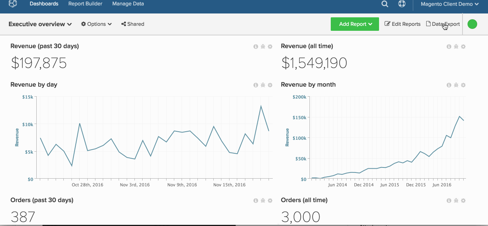

# 导出原始数据

使用原始数据导出，您可以从Data Warehouse导出记录，以更详细地了解为您的仪表板提供支持的功能。 此外，原始数据导出还可以帮助您[查明数据差异](https://experienceleague.adobe.com/docs/commerce-knowledge-base/kb/troubleshooting/miscellaneous/using-data-exports-to-pinpoint-discrepancies.html)。

通过原始数据导出，可访问通过取消标准化和预聚合相关量度生成的其他列和维度。 例如，`User's first order date`是一个维度，您可以为[!DNL Commerce Intelligence]中的每个用户导出该维度，但它可能在数据库中不可用。

本教程涵盖以下内容：

* [选择要导出的数据](#select)
* [正在下载导出(](#download)
* [访问历史导出](#historical)

## 步骤1：选择要导出的数据 {#select}

有两种方式可以在[!DNL Commerce Intelligence]中导出原始数据：

1. 在图表级别
1. 在表级别

### 在[!UICONTROL Manage Data]选项卡的表级别导出

如果要从[!UICONTROL Manage Data]选项卡导出表，则需要[管理员](../administrator/user-management/user-management.md)权限。

1. 单击&#x200B;**[!UICONTROL Manage Data** > **&#x200B;导出数据&#x200B;**> **原始数据导出]**。
1. 您会看到`Export List`个最近创建的数据导出（如果存在）。 单击&#x200B;**[!UICONTROL Add Export]**&#x200B;以创建导出。
1. 将显示`New Raw Data Export`对话框。 在此，您可以通过选择或取消选择列和筛选器来自定义导出：

   * `Table` - `Table`字段选择从中导出数据的表。 默认情况下，这会显示您导航到的表。
   * `Export Name` — 在此字段中，输入导出的名称。 例如： `Philadelphia - Daily Revenue`。
   * `Available Columns` — 此字段列出数据库中可包含在导出中的列（维度）。 要添加列，请单击其名称。
   * `Selected Columns` — 此字段列出当前包含在导出中的列（维度）。 要删除列，请单击其名称。
   * `Filter` — 此部分列出当前应用于导出的筛选器。 这些筛选器可以更改；还可以添加新的筛选器以导出特定数据集。
   * 完成后，单击&#x200B;**[!UICONTROL Export Data]**。

### 从功能板在图表级别导出

1. 单击任何图表右上角的齿轮图标。

1. 从下拉列表中选择`Raw Export`以显示`Raw Export`对话框。

1. 通过选择要包含或排除的`table`、`columns`和`filters`自定义导出。 有关本模块中字段的更多详细信息，请参阅上一节。

   >[!NOTE]
   >
   >默认情况下，`Table`字段中显示的表是为该图表提供支持的表。

1. 完成后，单击&#x200B;**[!UICONTROL Export Data]**。

在图表级别查看整个过程。

## 步骤2：下载导出 {#download}

在`Raw Data Export`对话框中完成选择后，将立即开始处理导出。 由于某些导出可能规模较大，因此限制为1000万行，并且运行可能需要一些时间。

要检查导出是否已准备就绪，请单击屏幕右上角的&#x200B;**[!UICONTROL Raw Data Exports]**。 单击&#x200B;**[!UICONTROL Download]**&#x200B;可下载导出的压缩`.csv`文件。

## 步骤3：访问历史导出 {#historical}

要查看您过去的导出，请单击屏幕右上角的&#x200B;**[!UICONTROL Raw Data Export]**。 待定和已完成报告最多可存取7天。
