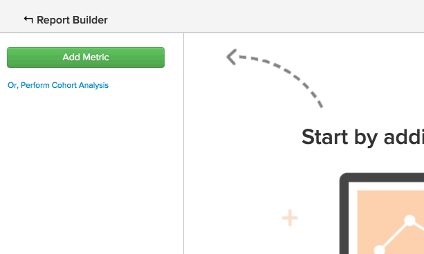
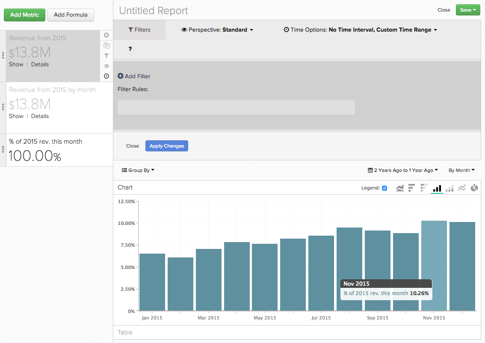
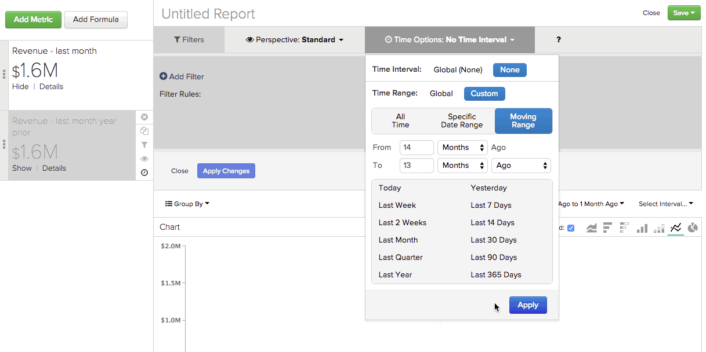
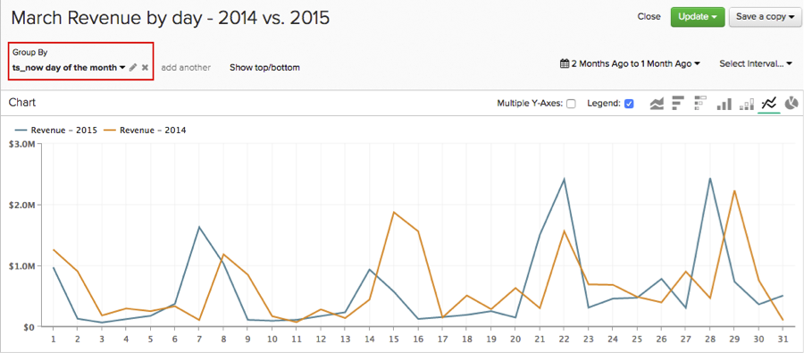
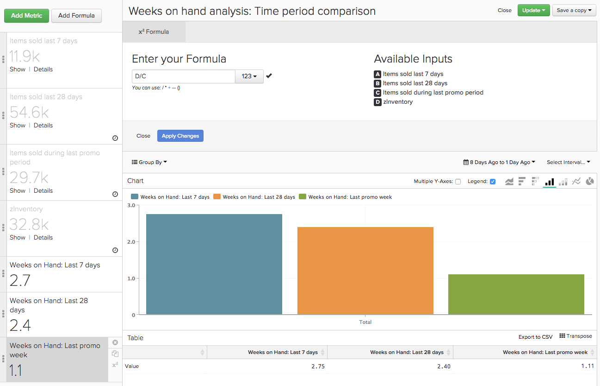

# 使用 [!DNL Time] 中的选项 [!DNL Visual Report Builder]

功能之一 [!DNL Visual Report Builder] 是全局的 `Time Range` 和 `Interval` 设置。 利用这些设置，可分析特定时间段内的报表数据。

但是，对于某些分析，可能需要在同一报表中考虑不同的时间范围或时间间隔。 这就是 `Time` 有选项可用。 让您更好地了解如何使用 `Time` 选项，本教程涵盖以下用例：

* [分析不带时间戳的量度](#notimestamp)
* [为一个量度指定独立的时间间隔](#independenttimeinterval)
* [比较不同时间范围内的相同量度](#difftimerange)

如果要遵循本主题中讨论的一些示例报告，请打开 [[!DNL Visual Report Builder]](../data-user/reports/ess-rpt-build-visual.md) 然后再继续。

## 分析不带时间戳的量度 {#notimestamp}

某些量度根本无法随时间推移而趋势，因为未收集数据或将数据与关联的时间戳一起存储。 例如，库存表通常只包含每个SKU的一行。 在这种情况下，您应该 [创建量度](../data-user/reports/ess-manage-data-metrics.md) 而不指定时间戳。

在报表中使用此类量度时，您会注意到，将此量度添加到报表会自动设置一个独立的 `Time Interval` 之 `None` 和 `Time Range` 之 `Global`：

## 为一个量度指定独立的时间间隔 {#independenttimeinterval}

`Time` 利用选项，可创建基于时间的100%图表，以识别在特定时间范围内哪天、周、月或年贡献了最大的值。 在此部分中，您将创建一个图表，显示一年中每个日历月产生的收入的百分比。

如果要比较年同比产生的收入，此类报表可能会很有用。 例如，您有一张2015年的图表显示，1月占全年收入的18%，而另一张图表显示2016年仅占8%。 你可以开始研究可能发生的事。

1. 添加您的 `Revenue` 报表的量度。
1. 单击 **[!UICONTROL Duplicate]** 以制作量度的副本。
1. 单击全局 **[!UICONTROL Time Range]** 选项，然后 **[!UICONTROL Moving Time Range]**. 将此项设置为 `Last Year`.
1. 单击全局 **[!UICONTROL Time Interval]** 选项并将其设置为 `Monthly`.
1. Report Builder会自动为第二个量度添加第二个Y轴。 取消选择 `Multiple Y-Axes` 盒子。
1. 接下来，应用独立的 `Time Interval` 到第一个量度。 单击 **[!UICONTROL Time Options]** （时钟图标） `first Revenue metric`.
1. 单击 **[!UICONTROL Time Options]** 在报表上方显示的展开窗口中。
1. 在下拉菜单中，设置以下内容：

   * `Time Interval`：将此项设置为 `None`.

   * `Time Range`：将此项设置为 `Last Year` 通过首次单击 **[!UICONTROL Custom]**，则 **[!UICONTROL Moving Range]**，最后选择 `Last Year` 选项。

   * 单击 **[!UICONTROL Apply]** 以保存间隔和范围设置。 这将创建一个量度，用于计算上一年度的总收入。 接下来，将此量度用作公式中的分母。

   * 要查看每个月的收入百分比，您必须向报表中添加一个公式。 单击 **[!UICONTROL Add Formula]**.

   * 输入 `B/A` 在公式字段中，然后选择 `% Percent` 文本字段旁边的下拉菜单中。 此公式将去年特定月份的收入额除以去年的收入总额。

   * 单击 **[!UICONTROL Apply Changes]**.

   * 隐藏两个输入量度并重命名公式。

现在，您可以看到去年每个月的影响力有多大：

## 比较不同时间范围内的相同量度 {#difftimerange}

此示例使用名为的自定义维度 `Day number of the month`. 如果要创建此报表，但您的Data warehouse中还没有此维度， [联系支持人员](https://experienceleague.adobe.com/docs/commerce-knowledge-base/kb/troubleshooting/miscellaneous/mbi-service-policies.html) 以寻求帮助。

此类别中最常见的两个示例是(1)比较增长指标（年收入或月收入）和(2)更好地了解最近的库存或物料销售趋势。

要演示此用例，请查看上个月的每日收入与去年同期相比。 假设您要查看2016年1月的每日收入，然后将其与2015年1月、2014年1月等进行比较，此报表会显示该信息。

1. 添加您的 `Revenue` 报表的量度。
1. 单击 **[!UICONTROL Duplicate]** 以制作量度的副本。
1. 将第一个量度重命名为 `Items sold last 7 days` 第二个量度为 `Items sold last 28 days`.
1. 单击 **[!UICONTROL Time Range]**，则 **[!UICONTROL Moving Time Range]**. 将此项设置为 `Last Month`.
1. 单击 **[!UICONTROL Time Interval]** 并将其设置为 `None`.
1. 单击 **[!UICONTROL Time Options]** （时钟图标） `Revenue` 量度。
1. 单击 **[!UICONTROL Time Options]** 在报表上方显示的展开窗口中。
1. 在下拉菜单中，设置以下内容：

   * `Time Interval`：将此项设置为 `None`.

   * `Time Range`：将此项设置为 `From 14 Months Ago To 13 Months Ago` 通过首次单击 **[!UICONTROL Custom]** 则 **[!UICONTROL Moving Range]**. 使用菜单顶部的字段和下拉菜单设置范围。 此设置允许我们查看上个月但上一年度的收入。
   如果量度从报表中消失，请不要担心 — 设置独立的时间选项会自动从报表中隐藏该量度。 要重新显示它，请单击 **[!UICONTROL Show]** 指标旁边。

   

   * 单击 **[!UICONTROL Apply]** 以保存间隔和范围设置。

   * 接下来，添加您的自定义 `Day number of the month` 通过单击维 **[!UICONTROL Group By]** 并选择维度。 这将返回订单当月的日期编号 — 例如，在3月2日下单的订单将返回 `2`.

   * 在 `Group By` 下拉列表，选择 `Show All` 并单击 **[!UICONTROL Apply]**. 这将为报表创建X轴值：

   

   * 重命名量度。 在本例中，第一个量度是 `Revenue - 2015` 第二个是 `Revenue - 2014`.

自定义的另一种常见用法 `Time Options` 是确定供应周数。 特别是在假日季节或特殊促销期间，您可能需要考虑在上周、月和上一个促销期间销售的项目，以便做出明智的购买决策。

切记在自行构建此报表时将时间范围设置为所需的值。

1. 添加您的 `Items Sold` 报表的量度。
1. 单击 **[!UICONTROL Duplicate]** 以制作量度的副本。
1. 重命名量度。 您可以使用相同的名称或类似名称：
   1. 将第一个量度重命名为 `Items sold last 7 days`.
   1. 将第二个量度重命名为 `Items sold last 28 days`.
1. 在 `Items sold last 7 days` 量度，单击全局 **[!UICONTROL Time Range]** option then **[!UICONTROL Moving Time Range]**. 在本例中，您将其设置为 `Last 7 Days`.
1. 单击 **[!UICONTROL Time Interval]** 并将其设置为 `None`.
1. 接下来，您定义 `Time Options` 对于 `Items sold last 28 days` 量度。 单击 **[!UICONTROL Time Options]** （时钟图标） `second Items sold` 量度。
1. 单击 **[!UICONTROL Time Options]** 在报表上方显示的展开窗口中。
1. 在下拉菜单中，设置以下内容：

   * `Time Interval`：将此项设置为 `None`.
   * `Time Range`：将此项设置为 `From 29 days to 1 day ago` 通过首次单击 **[!UICONTROL Custom]**，则 **[!UICONTROL Moving Range]**. 使用菜单顶部的字段和下拉菜单设置范围。
   * 单击 **[!UICONTROL Apply]** 以保存间隔和范围设置。
   * 复制 `Items sold last 28 days` 量度并打开新量度的 `Time Options`. 将选项设置为以下内容：

      * `Time Interval`：将其保留为 `None`.
      * `Time Range`：通过单击，将其更改为与您感兴趣的促销活动相符的日期范围 **[!UICONTROL Specific Date Range]** 然后输入相应的日期。
      * 重命名量度 `Items sold during last promotion` 或是类似的事。
      * 添加您的 `Units on hand` 量度。
      * 接下来，您必须添加计算值，以便根据销售趋势显示各个时间段的现有周数(`last 7 days`， `last 28 days`、和 `last promo` 句点)以将其包含在报表中。 您必须为每个时间段执行此操作一次。

要创建公式，请单击 **[!UICONTROL Add Formula]**. 输入以下公式并单击 **[!UICONTROL Apply Changes]** 完成后。 对以下三个时间段中的每一个重复此操作：

* 对于 `last 7 days time period`，输入 `D / A` 在 `Formula` 字段。
* 对于 `last 28 days time period`，输入 `D / (B/4)` 在 `Formula` 字段。

   >[!NOTE]
   >
   >请务必在此处标准化您选择的时间范围。 在此示例中，将28天划分为四周。 您可能需要对公式应用不同的逻辑。

* 对于 `last promo period`，输入 `D / C` 在 `Formula` 字段。

   

* 最后，通过隐藏量度并添加 `SKU` 或与报表类似的维度 `Group By`.

此示例表明，当前库存水平非常适合于全产品14天销售。 不过，加上一个类似的促销期，表明该公司需要做出一些改变 — 要么订购更多的存货，要么只促销库存量足够多的商品。

由于客户随着时间的推移表现出的行为不同，在执行分析时，您可能会看到数据中的差异。 通过设置自定义时间选项，您可以快速创建复杂的分析，从而做出考虑历史趋势的数据驱动型决策。

